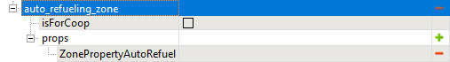

# AutoRefuel zones

*This topic is valid for SnowRunner only.*

If a zone has the **ZonePropertyAutoRefuel** property in **props**, it allows the player to automatically *refuel* the vehicle. 

No additional properties are required.

