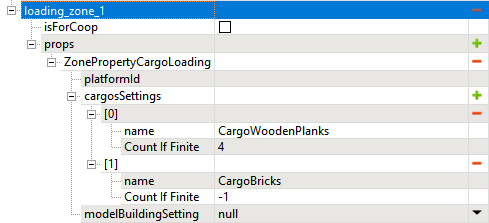

# CargoLoading and ManualLoading zones

*This topic is valid for SnowRunner only.*  

The **ZonePropertyCargoLoading** zones allow the player to load a cargo of the particular type within them.

The properties of this zone type are the following:

-   **platformId** - *optional field*, which allows you to specify the ID of the zone of the **ZonePropertyManualLoading** type. Within the zone with this ID, the system will spawn the physical cargo, which will allow the player to manually load it using the crane. I.e., to use this feature, you need to create an additional zone, set its ID to the value specified in the **platformId** field, and add the **ZonePropertyManualLoading** property to the **props** list of this additional zone.

-   **cargosSettings** - this list allows you to specify the types of cargo that the player will be able to obtain in this zone. For each type of cargo, you can specify the amount (**Count If Finite**) of cargo this zone can give to the player. You can add multiple types of cargo here (see the screenshot above). To add a type of cargo:

    -   Click the  next to the **cargosSettings** list.

    -   In the appeared list entry, double-click the default value next to the **name** field and select the necessary type of cargo.

    -   If necessary, double-click the **Count If Finite** and specify the amount of cargo this zone can give. The "**-1**" value in this field corresponds to the unlimited amount of cargo.

-   **modelBuildingSetting** -- *(optional settings)* These settings allows you to play animation after loading cargo from this zone to imitate the process of dismantling a building. See [Model Building Settings for CargoLoading zones](./model_building_settings_for_cargo_loading_zones.md) for details.

The **ZonePropertyManualLoading** zone is the zone that adds the "manual loading of the cargo" feature to the existing **ZonePropertyCargoLoading** zone (see **platformId** above). The **ZonePropertyManualLoading** zone itself has no properties.

Along with regular **ZonePropertyCargoLoading** zones there are two types of zones that are similar, but provide some debug functionality:

-   **ZonePropertyCargoLoadingAllCargo** -- Debug property. Similar to regular **ZonePropertyCargoLoading**, but allows the player to load all types of Cargo without limitations of their amount.

-   **ZonePropertyCargoLoadingAlwaysVisible** -- Debug property. Similar to regular **ZonePropertyCargoLoading**, but makes the zone always visible and available to the player.

