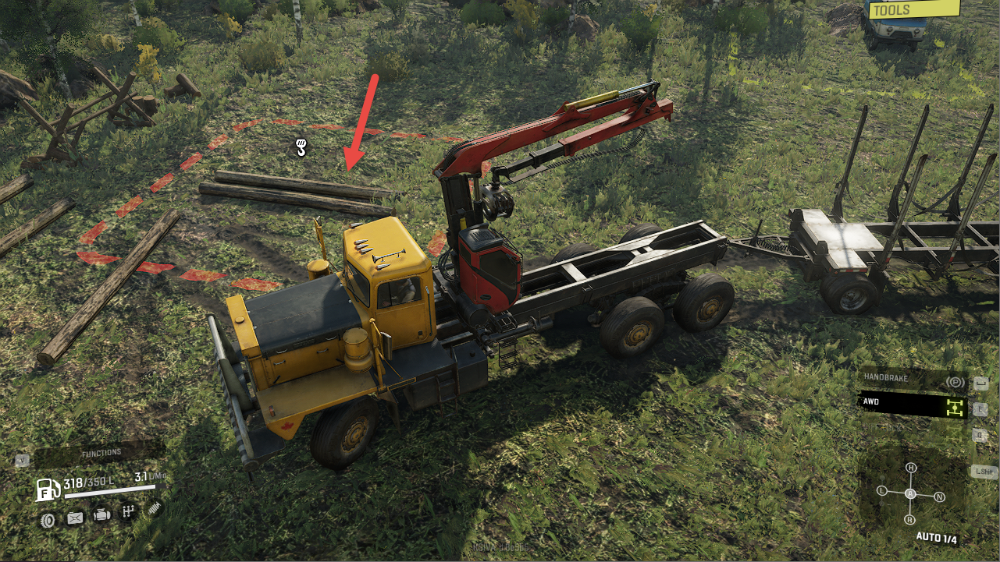
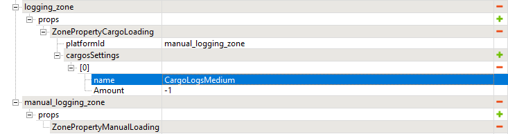

# Loading Logs as Cargo

*This feature is valid for SnowRunner only.*

Logging is based on logs of different kinds as types of cargo.

Particularly, you will find logs in the typical drop-down lists of cargo types. 

I.e., if you browse the list of cargo types within the [*ZonePropertyCargoLoading*][cargoloading_and_manualloading_zones] zone, you will find them there.

The names of these new cargo types are the following:

-   **CargoLogsLong** – corresponds to Long Logs

-   **CargoLogsMedium** – corresponds to Medium Logs

-   **CargoLogsShort** – corresponds to Short Logs

So, in the particular **ZonePropertyCargoLoading** zone, you can select one of these cargo types (in a standard way), and your zone will be giving the player the necessary type of logs. You can create both zones with auto-loading of logs or zones with their manual loading.

**NOTE**: See [CargoLoading and ManualLoading zones][cargoloading_and_manualloading_zones] for details on the creation of manual loading zones.

When setting up the manual loading zone, you may want to spawn your logs not on the ground, but in a way that is a little bit more convenient for the player. 

In this case, you can place the suitable model (e.g. **logs_scavange_02**) inside the zone locator of the manual zone and tune such properties of this zone locator as its direction (**Dir**) and dimensions (**Dimensions**) to spawn logs precisely above this model and make them fall to the necessary location.

[cargoloading_and_manualloading_zones]: ./cargo_loading_and_manual_loading_zones.md