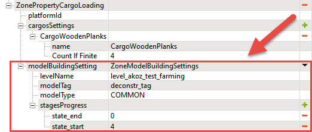

# Model Building Settings for CargoLoading zones

*This topic is valid for SnowRunner only.*  

The **modelBuildingSetting** settings of the **ZonePropertyCargoLoading** zone allow you to play animation after loading cargo from this zone. These settings are used for zones where we dismantle the particular building and transform it into some pieces of cargo.

**NOTE**: For main info on Model Building Settings and linking animated objects to cargo delivery or accomplishment of some Stages, see [Model Building Settings][model_building_settings].

These settings inside the **ZonePropertyCargoLoading** zone are similar to regular [Model Building Settings][model_building_settings], but there are some differences in the setup since we are not building, but dismantling here.

Particularly, as opposed to regular Model Building Settings:

-   *Not* *all* `_objective` models are valid for usage with these Model Building Settings. You can identify the ones that can be used by the `constr` prefix in their names while selecting a model in the **Select Asset** window.
    
    

-   *Names of states* of the model in its XML class are different. For example, in `initial.pak\[media]\_dlc\us_03\classes\models\constr_wood_01_objective.xml` you will see such states as `state_start` and `state_end`.

    

-   *Rules* for specifying these states in the **stagesProgress** are different. Particularly, as opposed to regular Model Building Settings, the value of the `state_start` state must be *larger* than the value of the `state_end` state. And, more precisely, you need to specify the initial amount of cargo of the zone (the value of the **Count If Finite** field) as the value of the `state_start` state and 0 as the value of the `state_end` state. This will tell the system to substitute the initial model with the dismantled model when the player will get the last cargo item from the zone. For example:
    
    

**NOTE**: The `_objective` model still needs to be tagged to link it with these settings. See [Model Building Settings][model_building_settings] for details.

[model_building_settings]: ./../../../objectives/model_building_settings/model_building_settings.md