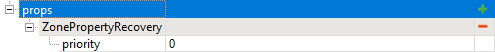

# Recovery zones

*This topic is valid for SnowRunner only.*  
*For Recovery zones in Expeditions, see [Recovery zones](./../expeditions_zones/recovery_zones.md).*

The **ZonePropertyRecovery** zone works as a target point for the "RECOVER" feature from the **functions** menu.

If there are multiple zones of that type, the **priority** field allows you to set the priority for it. The player's car will be recovered to the zone with the highest **priority** value.

In the game, the Recovery zones are invisible to the player.

If the map contains the Garage and the player has opened it, all recovery zones will be ignored and the player will be transferred to the Garage after usage of the "RECOVER" feature.

