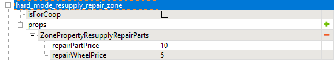

# ResupplyRepairParts zones

*This topic is valid for SnowRunner only.*  

The **ZonePropertyResupplyRepairParts** property allows you to create Resupply Repair Parts zones that will work specifically in Hard Mode.

**NOTE**: In the Normal Mode of the game, this property will be ignored.

The ...**ResupplyRepairParts** zone has two settings:

-   **repairPartPrice** – specifies the price per resupplying 1 repair point.

-   **repairWheelPrice** – specifies the price per resupplying 1 spare wheel.

**NOTE**: For info on automatic repair zones, see [AutoRepairAndRestore zones](./auto_repair_and_restore_zones.md).

