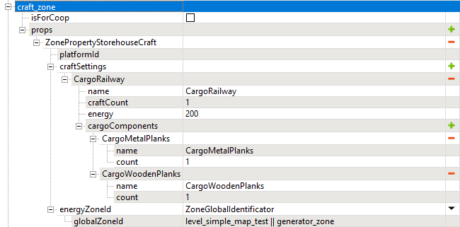

# StorehouseCraft and Energy zones

*This topic is valid for SnowRunner only.*  

The **ZonePropertyStorehouseCraft** zone allows you to enable crafting on your map.

The **ZonePropertyEnergy** zone allows you to set energy produced by the Generator as one of the components that are necessary while crafting.

Settings of the **ZonePropertyStorehouseCraft** zone are the following:

-   **platformId** - *optional field*, *similar to the same property in the **...CargoLoading** zones*. This field allows you to specify the ID of the zone of the **ZonePropertyManualLoading** type. Within the zone with this ID, the system will spawn the physical cargo, which will allow the player to manually load it using the crane. I.e., to use this feature, you need to create an additional zone, set its ID to the value specified in the **platformId** field, and add the **ZonePropertyManualLoading** property to the **props** list of this additional zone.

-   **energyZoneId** - *optional field*, *used only when crafting uses Energy as a requirement*. This field allows you to specify the ID of the zone of the **ZonePropertyEnergy** type, where the player needs to deliver a Generator (which needs to be turned on to produce Energy).

-   **craftSettings** -- a list that should contain all target cargo items that can be crafted in this zone and the components they are crafted from. If Energy is required while crafting a particular target cargo item, its amount should also be specified in its settings. Particularly, for each target cargo item in the list you need to specify the following:

    -   **name** -- the type of the target cargo item to be crafted.

    -   **craftCount** -- the amount of the target cargo item to be crafted.

    -   **cargoComponents** -- the list of the required source components, with their types (**name**) and required amounts (**count**).
        
        **WARNING**: The number of the source components is limited. If you do not require Energy, the maximum number of components is 4. If you do require Energy, only 2 other source components can be added. If you exceed these limits, your settings will not pass validation.

    -   **energy** -- *optional field*, *used only when you want the player to use Energy while crafting as a requirement (so, the player needs to deliver a generator to **energyZoneId**, and so on)*. The number of energy units required for crafting this target cargo item. If this value is 0, the energy is not required.

The **ZonePropertyEnergy** zone has no properties that you need to specify - only the **ZonePropertyEnergy** property itself is required. This zone is mandatory if you want to set Energy as a requirement for crafting. The player needs to deliver a Generator to this zone and turn it on to be able to craft in the linked **ZonePropertyStorehouseCraft** zone (see **energyZoneId** above).

The UI displayed while crafting is regular:

