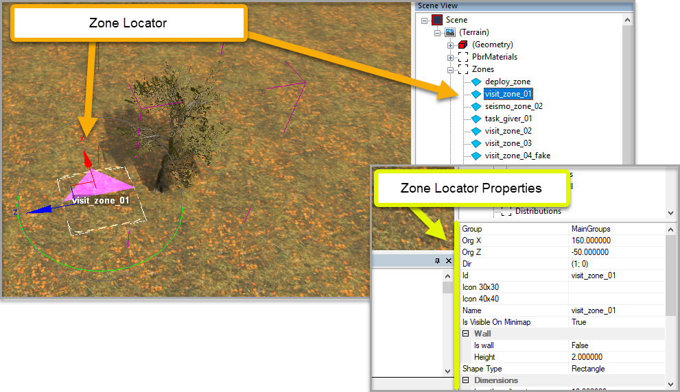
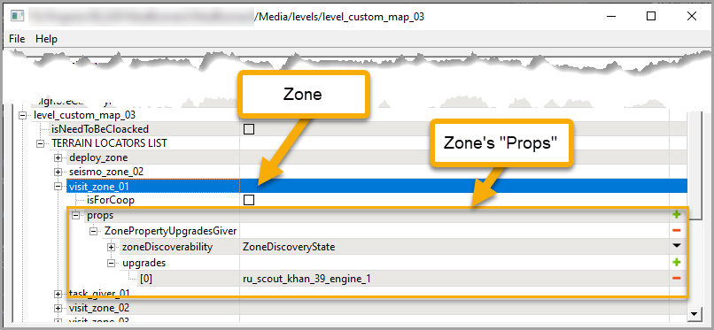

# Zones: Overview

## Overview
Using *zones* you can add to your map such in-game entities as:

-   For *Expeditions*:
    -   Deploy zones (for deploying trucks)
    -   Inventory Storage zones (for Air Drops and FOB Modules)
    -   Minigame zones (for playing minigames)
    -   and so on

-   For *SnowRunner*:
    -   Fuel Stations (for refueling trucks)
    -   Garage (for changing trucks, access to Truck Store, etc.)
    -   Cargo Loading Zones (for loading cargo to trucks)
    -   and so on

    **NOTE**: For full lists of available zones, see [Zone Types in Expeditions][zone_types_expeditions] and [Zone Types in SnowRunner][zone_types_snowrunner].

And, which is equally important, zones are intensively used in various [objectives][objectives_overview] – Expeditions (for *Expeditions*), Contracts, Tasks, and Contests (for *SnowRunner*). See [Objectives: Overview][objectives_overview] for details.

**NOTE**: Zones cannot be used in References. They can be added there, but they will not work correctly on the target map when the Reference with these zones will be added to it.

## Zone Locator and "Props"
Every zone consists of two main parts: *zone locator* and *props*.

### Zone Locator
The *zone locator* of the zone is the *visual* representation of the zone that is added in the Editor itself. 

It allows you to set up the location of the zone and its (visual) propeties: size, name, icons, etc.

Properites of the zone locator are specified in the standard properties panel at the right lower corner of the Editor, afer selecting the necessary zone locator in the **Scene View** panel. For details on these properties, see [Zone Locator Properties][zone_locator_properties].

*Sample **Zone Locator** in Expeditions, with its Properties:*

### Props
The *props* of the zone define the *gameplay mechanics* of the zone and the *logic* of its operation. 

I.e, these settings define the functions available in this zone, interaction with it, etc. 

These props are added using the special Zone Settings plugin that can be opened by clicking the **Zone Settings** () button on the toolbar of the Editor. 

In the Zone Settings plugin window, these props are added to:

-   **`<name_of_level>`**
    -   **TERRAIN LOCATORS LIST**
        -   **`<name_of_zone_locator>`**
            -   **props** list.

**NOTE**: The **TERRAIN LOCATORS LIST** will contain all zones added to your map as zone locators. They will be named according to their identifiers. Actually, zone locators in the Editor and their zone settings specified in the **TERRAIN LOCATORS LIST** are linked by these identifiers. Due to that, identifiers of zone locators in the Editor and names of the corresponding entries in the **TERRAIN LOCATORS LIST** must be exactly the same and must not contain spaces.

The *type(s)* of the zone are defined by the particular props added to the **props** list. For example, the *ZonePropertyUpgradesGiver* prop will set up that this zone will be giving upgrades to the player. 

From the point of view of type-specific zone properties, there are two categories of zones in the game:

-   Zones that have a particular type: Upgrades Giver, Deploy Zone (for *Expeditions*), Fuel Station (for *SnowRunner*), etc. These zones should have the **props** section with a set of props corresponding to the type of the zone.

-   Zones that just map a specific area on the map to some ID, which is used somewhere else. Typically, these zones are somehow related to [objectives][objectives_overview]. For example, you need to create the zone that the player needs to deliver a truck to. These zones can have the empty **props** section. However, *some* zones created for objectives do require configured props – e.g. [minigame zones][minigames_overview] in *Expeditions*.

For details on prop types, see [Zone Types Overview][zone_types_overview]

*Sample **Props** of the same zone in Expeditions:*

## Process of Adding a Zone

### Step 1: Add Zone Locator

To add and configure a [zone locator](#zone-locator), do the following:

1.  Open the necessary map in the Editor.

2.  Add the zone locator to the map.  
    To do this:

    1.  Right-click the terrain (or the **Zones** section in the **Scene View** panel), and select **Add Zone** from the context menu.

    2.  Move the locator to the necessary location of the map in a standard way.

3.  Specify the ID of the zone locator.  
    To do this:

    1.  Select the created zone. Initiallly, it will be displayed in the **Zones** section in the **Scene View** panel as the `no_id` zone.

    2.  In the [zone locator properties](#zone-locator) (in the lower part of the **Scene View** panel), specify the identifier of the zone in the **Id** field.

    **NOTE**: All zone identifiers can contain only small Latin letters, digits, and underscores (`_`). For example, `test_zone_01`.

4.  In the [zone locator properties](#zone-locator), specify other properties of the zone locator, such as its name for UI, icons, etc. See [Zone Locator Properties][zone_locator_properties] for details.

5.  Save the map to save the zone locator and its properties.

### Step 2: Configure Zone Props

To configure the [props](#props) of the added zone locator, do the following:

1.  On the toolbar of the Editor, click the **Zone Settings** button ().

2.  In the plugin window, expand the section named as your map.

3.  Expand the **TERRAIN LOCATORS LIST** there. 

4.  Depending on the category of the zone from the point of view of type-specific zone properties (see [above](#props)), either add [some particular prop types][zone_types_overview] to the **props** section of the zone, or leave the **props** section empty.  
    To add and configure prop:

    1.  Click the plus button () next to **props** section.

    2.  In the appearing dialog, select the type of the zone. For example, *ZonePropertyUpgradesGiver*. After selection, click **OK**.

    3.  This will add to the **props** section the set of properties that corresponds to the selected *type* of zone.

    4.  Setup the logic of the zone by filling in the appeared fields that correspond to selected *type*.  
    For details, see [Zone Types in Expeditions][zone_types_expeditions] and [Zone Types in SnowRunner][zone_types_snowrunner].

    **NOTE**: In *SnowRunner*, zones in Zone Settings plugin have the **isForCoop** option also, see [SnowRunner Specifics](#snowrunner-specifics) below.

5.  Save your changes. To do this, in the plugin window, press CTRL + S or select **File \> Save** in the main menu.

### Step 3: Testing
After performing Steps 1 and 2, you can [pack][packing] your map and [test][testing] your configured zone(s) in the game.

**NOTE 1**: In *Expeditions*, you will need at least one Expedition and Deploy zone to load your map, see [Expeditions Specifics](#expeditions-specifics) below.

**NOTE 2**: If you have created a standalone zone with the empty [**props**](#props) section, it will *not* be visible in the game until you start referencing it in some [objectives][objectives_overview] or other zones' props.

### Expeditions Specifics
In *Expeditions*, to be able to load the map and test your configured zones, you need to:

-   Add at least one properly configured [Deploy zone][deploy_zones] to the map.
-   Create at least one [Expedition][expeditions_and_contracts] for this map.

### SnowRunner Specifics
In *SnowRunner*, all zones also have the **isCoop** option above the **props** section. This option was developed specifically for racing Contests of the DLC 7 (*"Season 7: Compete & Conquer"*). 

Enabling this option marks this zone as specifically "cooperative" zone that will work and will be visible in the COOP mode *only*. 

Typically, this option is enabled only for zones related to objectives that work in COOP (they also have the **isCoop** option) and only when these zones are *not* used in the single player mode. If the zone is used both in COOP and single player modes (in different objectives) this option should be disabled for it.

## Source Files Location
Properties of [*zone locators*](#zone-locator) are saved along with other properties of the map in its subfolder within the `Media\prebuild` folder, see [File Paths][file_paths] for details. Particularly, properties of zone locators can be found within the `_zones.xml` there.

Settigs of [*props*](#props) of zones are saved in the folder of the map within the `\Media\levels` folder. In this folder, there are 3 files related to zone props and [objective][objectives_overview] setings:

-   `user_name_of_map.txt` – stores the name of your map (to link properties to it).
-   `zone_settings.json` – stores specified zone properties in the JSON format.
-   `objective_settings.json` – stores the properties of objectives.

## Validation
You should specify the properties of every zone very carefully. The Editor allows you to configure a zone with *incorrect* props, which can result in unpredicted behavior and errors.

However, the system validates some aspects of the zones configuration during [packing][packing]. 

The log of occurring errors can be found in the folder of the game within
`Documents\My Games\`, at the following path: `base\logs\ModMapError.txt`.

I.e., the full path to this log is typically similar to: 

For *Expeditions*:  
`C:\Users\<username>\Documents\My Games\Expeditions\base\logs\ModMapError.txt`

For *SnowRunner*:  
`C:\Users\<username>\Documents\My Games\SnowRunner\base\logs\ModMapError.txt`

[zone_types_expeditions]: ./expeditions_zones/zone_types_in_expeditions.md
[zone_types_snowrunner]: ./snowrunner_zones/zone_types_in_snowrunner.md
[objectives_overview]: ./../objectives/objectives_overview.md
[zone_types_overview]: ./zone_types_overview.md
[deploy_zones]: ./expeditions_zones/deploy_zones.md
[expeditions_and_contracts]: ./../objectives/objectives_in_expeditions/expeditions_and_contracts.md
[minigames_overview]: ./../minigames/minigames_overview.md
[file_paths]: ./../../getting_started/file_paths_and_naming/file_paths.md
[packing]: ./../../packing_and_publishing_maps/packing_maps.md
[testing]: ./../../packing_and_publishing_maps/testing_maps.md
[zone_locator_properties]: ./zone_locator_properties.md
