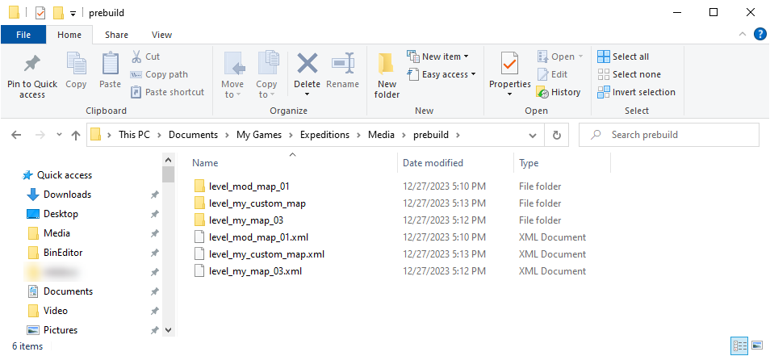

# File Paths

## Source Files
*Most* of source data for custom maps is stored in the `Media\prebuild` folder, which is created in the *subfolder of the game* within the `Documents\My Games\` folder.

The full path to it is typically similar to the following:

-   For *Expeditions*: `C:\Users\<name_of_user>\Documents\My Games\Expeditions\Media\prebuild`

-   For *SnowRunner*: `C:\Users\<name_of_user>\Documents\My Games\SnowRunner\Media\prebuild`

**NOTE**: For Closed Beta Testing version of the *Expeditions* game, paths will be similar but with the `...Beta` in the name of the game.

*For example, for Expeditions this folder may look like this:*

However, the `prebuild` folder will be filled with folders and files of levels *after* you create them. At the first launch of the Editor, this folder is empty.

In this folder, every map corresponds to the `<name_of_the_level>.xml` file. For example: `level_my_map_03.xml`. This is the main file of the level and the file you need to click in the **File View** panel of the Editor to start editing the corresponding map. 

The folder with the same name – e.g. the `level_my_map_03` *folder* – contains most of source data of the level, its source textures, and so on.

However, this folder contains *not all* source files. Source files for settings of [Objectives][objectives_overview] and [Zones][zones_overview] are stored in the *folder of the map* within the `Media\levels` folder, in the `.json` format.

## Compiled Files and Objectives/Zones Settings

Compiled data of the level – generated by Editor when you build the map – is stored in the *folder of the map* within `Media\levels` folder.

This folder contains also *source files* for settings of [Objectives][objectives_overview] and [Zones][zones_overview]. These files are stored in the `.json` format.

## After Packing: .pak and .zip Archives
When you [pack][packing] the level in the Editor, the system also generates two sets of files:

-   set of `.pak` files – that are necessary for local testing.

-   set of `.zip` files – that are intended for uploading to mod.io.

The `.pak` files are stored in `Media\Mods` folder.

The `.zip` files are stored in `Media\levels` folder (in its root, *not* within the folder of the map).

For more details, see [Packing Maps][packing].

## Source of Info: initial.pak Archive 

Some content that you will need can be looked up in the `initial.pak` archive. 

`initial.pak` contains a lot of info that can be helpful: XML classes of the models, trucks, and so on.

This archive is located in *the folder of the installed game*, in the `...\preload\paks\client\` subfolder.

For *SnowRunner*, this archive also contains content of DLCs. For example, XML classes of models are located *not only* in the `[media]\classes\models` subfolder of this archive, but also at the same path in the DLC subfolders of the `[media]\_dlc` directory.

[objectives_overview]: ./../../creating_a_map/objectives/objectives_overview.md
[zones_overview]: ./../../creating_a_map/zones/zones_overview.md
[packing]: ./../../packing_and_publishing_maps/packing_maps.md

