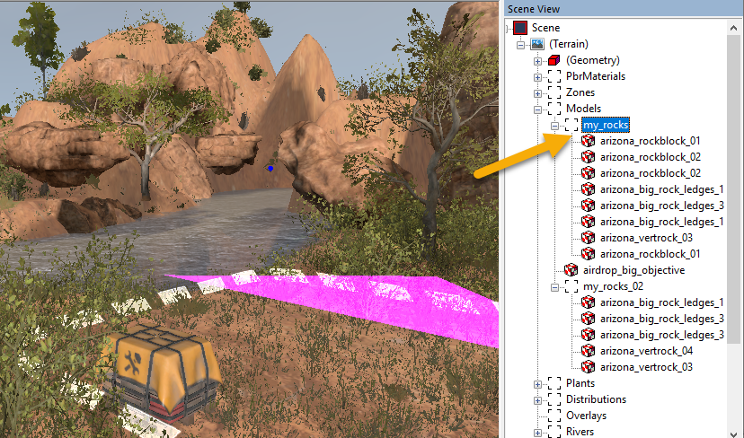

# Groups

## Overview
When you are working with objects in the Editor, you can use Groups as categories for these objects and form an hierarchy. These groups can contain only objects of the same type (e.g. only models, or only plants, etc.).

The main goal of groups is to help you organize objects.

## Process

### Adding Groups

To add a group:

1.  Right-click the necessary section in the **Scene View** hierarchy (e.g. **Models**) and select **Add Group** from the context menu.

2.  After doing this, the group with the few digits as a name will appear in the hierarchy.

3.  Give the necessary name to the group:

    -   Keep the group selected in the **Scene View** panel.

    -   In the properties of the group (at the lower part of the **Scene View** panel), locate the **Name** field and change its value.

### Assigning Objects to Groups
To assign an object to a group:

1.   Select the target object in the **Scene View** panel.

2.   In the object properties, in the **Group** field, select the group you have created.

3.   After doing this, the object will be moved to the group.

### Selecting Multiple Objects
When objects are in the group, it is easier to [select multiple objects](./selection_of_multiple_objects.md) from them.

### Copying Groups of Objects to Another Map
After the creation of the group and assigning objects to it, you can copy all the objects from this group to another map.

This is possible because information about objects added to the group is saved to a separate file in the `subgroups` directory *within the folder of the level* in [`prebuild`](./../file_paths_and_naming/file_paths.md).

**NOTE**: The file corresponding to the group of objects will appear in the `subgroups` directory after [packing](./../../packing_and_publishing_maps/packing_maps.md) the level. 

So, you can copy the file corresponding to your group from this directory to the `subgroups` directory of another level. 

After that, the objects from this group will appear at this level, when you open it in the Editor.

Please note that objects from the copied group will appear within the new map *at the same positions they have on the initial map*.

