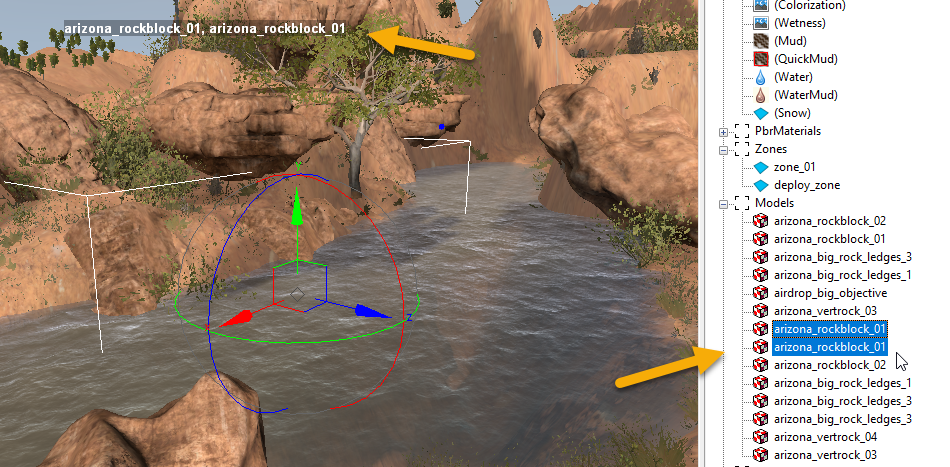

# Selection of Multiple Objects

The Editor supports the selection of multiple objects of the same type (e.g. Models, Plants, etc.)

To select multiple objects, hold CTRL while clicking on them (either in the main window or in the **Scene View** panel). 

Objects will be displayed as selected in the **Scene View** panel, and names of the selected objects will be displayed in the main window next to the pivot, which is common for the selected objects:

To select adjacent objects in the **Scene View** panel, hold SHIFT while selecting them.

