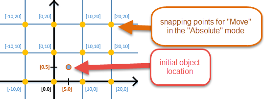

# Snapping Panel

The **Snapping** panel allows you to snap a currently selected object to particular coordinates and rotation angles. Particularly, you can set the *step* with which you will change the position and rotation of the object.

Snapping of objects is enabled when you hold SHIFT while moving or rotating an object.

The parameters that you can set in this panel are the following:

-   **Move** – sets the step in coordinates that will be used when you move the object with enabled snapping.

-   **Rotate** – sets the step in degrees that will be used when you rotate the object with enabled snapping.

-   **Snapping** – allows you to select the particular snapping mode:

    -   **None** – snapping is disabled.

    -   **Absolute** – the position and rotation are changed with the specified steps regardless of the initial position and rotation of the object. E.g., for **Move** – as if there was a grid with a center in the origin of coordinates and you were snaping the object to the grid points of this grid.  
        For example, if **Move** equals to `10` and the object is positioned in `[5, 5, 0]`, then the object will be snapped to the nearest points of such grid: `[0, 0, 0]`, `[10, 0, 0]`, `[0, 10, 0]`, `[0, 0, 10]`, `[10, 10, 0]`, and so on.

        \

        Or, if **Rotate** equals to `45`, then the object rotation will be snapped to the following rotation angles: `0`, `45`, `90`, etc. (regardless of its initial rotation).

    -   **Relative** – the position and rotation are changed with the specified steps relative to initial the values of position and rotation of the object. E.g., for **Move** – as if there was a grid with a center in the initial position of an object and you were snaping the object to the grid points of this grid.  
        For example, if **Move** equals to `10` and the object is positioned in `[5, 5, 0]`, then the object will be snapped to: `[-5, -5, 0]`, `[-5, 5, 0]`, `[-5, 15, 0]`, etc.        

        
        
        Or, if **Rotate** equals to `45` and the initial rotation is `[12, 0, 0]`, then the object rotation will be snapped to the following rotation angles: `[-33, 0, 0]`, `[12, 0, 0]` , `[57, 0, 0]`, `[57, 45, 0]`, and so on.

    **NOTE**: When you are rotating an object, you may notice that multiple angles are changing at once. This happens because the angles of rotation of the object are not mutually independent. For details, you can refer to <https://en.wikipedia.org/wiki/Euler_angles>.

If **Local transorm** () is enabled on the [toolbar](./toolbar_buttons.md), the **Absolute** and **Relative** modes of the snapping panel will work as if the **Relative** mode is active.

If **Move** is set to `0`, snapping will be disabled for move transformations. If **Rotate** is set to `0`, snapping will be disabled for rotate transformations.

The **Snapping** panel appears automatically after selecting an object. So, if you occasionaly close it when it is needed, just select the same object again.

