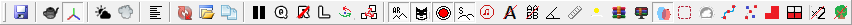

# Toolbar Buttons

Toolbars are almost the same for both editors.

*For Expeditions:*  

*For SnowRunner:*  

Descriptions of these buttons are below.

<table>
<colgroup>
<col style="width: 9%" />
<col style="width: 18%" />
<col style="width: 18%" />
<col style="width: 53%" />
</colgroup>
<tbody>
<tr class="odd">
<td><strong>Button</strong></td>
<td><strong>Name</strong></td>
<td><strong>Shortcut</strong></td>
<td><strong>Description</strong></td>
</tr>
<tr class="even">
<td></td>
<td><strong>Save</strong></td>
<td>CTRL + S</td>
<td>Saves the map and updates the <tt>data.stg</tt> file.</td>
</tr>
<tr class="odd">
<td></td>
<td><strong>Wireframe</strong></td>
<td>CTRL + W</td>
<td>Enables/disables rendering of the map in the wireframe mode.</td>
</tr>
<tr class="even">
<td></td>
<td><strong>Grid</strong></td>
<td>CTRL + G</td>
<td>Shows/hides the planar grid.</td>
</tr>
<tr class="odd">
<td></td>
<td><strong>Night</strong></td>
<td></td>
<td>Enables/disables the night mode. In the night mode, you can see how your level looks at night (lights, etc).</td>
</tr>
<tr class="even">
<td></td>
<td><strong>Fog</strong></td>
<td></td>
<td>Enables/disables the fog.</td>
</tr>
<tr class="odd">
<td></td>
<td><strong>Statistics</strong></td>
<td>CTRL + T</td>
<td>
Shows/hides the graphics statistics of the level: 
camera position, camera direction vector, amount of Draw Indexed Primitives (DIPs, “drawcalls”), faces, models, and so on.

<strong>TIP</strong>: You can use values displayed for camera position and camera direction vector when setting up various <strong>cameraPos...</strong> and <strong>cameraDir...</strong> vectors. See <a href="./../../../additional_info_on_maps/camera_values/tip_on_camera_pos_and_camera_dir_values/"><u>Tip on cameraPos and cameraDir values</u></a> for details.
</td>
</tr>
<tr class="even">
<td></td>
<td><strong>Reload Resources</strong></td>
<td>CTRL + R</td>
<td>Reloads models, textures, settings of the materials, XML classes, XMLs of the map and its references, and other meta-data.</td>
</tr>
<tr class="odd">
<td></td>
<td><strong>Open File</strong></td>
<td>ALT + SHIFT + O</td>
<td>Displays a dialog that allows you to quickly find and open a file from the <strong>Media</strong> folder.</td>
</tr>
<tr class="even">
<td></td>
<td><strong>Duplicate selected</strong></td>
<td>CTRL + D</td>
<td>Duplicates the object selected in the Editor.</td>
</tr>
<tr class="odd">
<td></td>
<td><strong>Pause</strong></td>
<td></td>
<td>Pauses/enables the default animations that may exist for the models in the Editor. For example, if you add the windmill model, and then disable and enable this option and Rebuild the level, you will see the animated windmill: 
 
It can be also used when viewing Trucks (see <a href="./../../../../truck_modding/additional_info_on_trucks/viewing_trucks/viewing_xml_file_of_the_class/"><u>Viewing XML file of the Class</u></a>).</td>
</tr>
<tr class="even">
<td></td>
<td><strong>Quick mode</strong></td>
<td></td>
<td>Enables/disables the Quick Mode in the Editor. This mode allows you to rebuild your map faster. If this button is activated, then the grass will not be calculated during the rebuild and there will be no grass in the terrain blocks that were rebuilt.</td>
</tr>
<tr class="odd">
<td></td>
<td><strong>No references</strong></td>
<td></td>
<td>If this button is activated, the Editor will ignore references during the rebuild of the map. The map will not contain visuals of the references if this mode was enabled before the rebuild.</td>
</tr>
<tr class="even">
<td></td>
<td><strong>Local transform</strong></td>
<td>CTRL + L</td>
<td>There are two coordinate modes for controlling objects: local and global. If you enable the <strong>Local transform</strong> mode, then the axes of an object will correspond to its position. If you disable this mode, then the axes along which you can move the object will correspond to the coordinate grid of the entire map.</td>
</tr>
<tr class="odd">
<td></td>
<td><strong>Change rotation basis</strong></td>
<td></td>
<td>Enables/disables the rotation around the selection center. I.e. when this option is selected, multiple selected objects will rotate as a whole when you rotate them; when disabled, every object will rotate relative its own center. 
 
<strong>WARNING</strong>: Enabling this option will block selection of individual points of overlays.</td>
</tr>
<tr class="even">
<td></td>
<td><strong>Change scale mod</strong></td>
<td></td>
<td>When this option is disabled (by default), all selected models are scaled independently from each other. However, if you enable this option, the system will keep the proportion in distance between them while you scale them.</td>
</tr>
<tr class="odd">
<td></td>
<td><strong>Enable autorebuild terrain</strong></td>
<td></td>
<td>Enables/disables the auto-rebuild of the terrain. If this option is activated, the terrain will be rebuilt each time you switch from one brush to another.</td>
</tr>
<tr class="even">
<td></td>
<td><strong>Show Distribution mask</strong></td>
<td></td>
<td>Shows/hides the distribution mask in the main view of the Editor when the particular distribution is selected. For details on distributions and their masks, see <a href="./../../../creating_a_map/distributions/adding_multiple_objects_via_distribution/"><u>Adding Multiple Objects via Distribution</u></a>.</td>
</tr>
<tr class="odd">
<td></td>
<td><strong>Show colored brush circle</strong></td>
<td></td>
<td>Enables/disables the highlighted circle below the mouse pointer when the particular brush is selected.</td>
</tr>
<tr class="even">
<td></td>
<td><strong>Show snow</strong></td>
<td></td>
<td>Shows/hides the snow coverage of the level in the Editor.</td>
</tr>
<tr class="odd">
<td></td>
<td><strong>Show all sound domains</strong></td>
<td></td>
<td>When this option is enabled, the Editor displays all sound domains on the level. By default, they are hidden until selection in the <strong>Scene View</strong> panel.</td>
</tr>
<tr class="even">
<td></td>
<td><strong>Hide Strings</strong></td>
<td></td>
<td>Shows/hides the names of the objects displayed next to them in the main window of the scene.</td>
</tr>
<tr class="odd">
<td></td>
<td><strong>Hide AABB</strong></td>
<td></td>
<td>Show/hides the Axis-Aligned minimum Bounding Boxes (<a href="https://en.wikipedia.org/wiki/Minimum_bounding_box#Axis-aligned_minimum_bounding_box">AABB</a>s) of objects on the map (models, plants, etc.). This option works for even not selected objects when the camera is near to them.</td>
</tr>
<tr class="even">
<td></td>
<td><strong>Show Heightmap Angles</strong></td>
<td></td>
<td>Displays the map of heightmap angles for the level.</td>
</tr>
<tr class="odd">
<td></td>
<td><strong>Use Ruler</strong></td>
<td></td>
<td>Enables/disables the <strong>Ruler</strong> tool, which allows you to create splines and measure distances. After enabling the tool, you can add points to the ruler spline by right-clicking and selecting <strong>Add before</strong> and <strong>Add after</strong> in the context menu. The spline works similarly to the mechanism of overlays (see <a href="./../../../creating_a_map/overlays/adding_overlays/"><u>Adding Overlays</u></a>).</td>
</tr>
<tr class="even">
<td></td>
<td><strong>Terrain brightness</strong></td>
<td></td>
<td>It allows you to increase or decrease the brightness of the preview of the level in the appearing dialog. It is used for previewing the level in the Editor only. Particularly, it is useful to decrease brightness when working with snowy levels.</td>
</tr>
<tr class="odd">
<td></td>
<td><strong>Pack terrain</strong></td>
<td></td>
<td>Packs your map and generates the <tt>.zip</tt> and <tt>.pak</tt> files. For details, see <a href="./../../../packing_and_publishing_maps/packing_maps/"><u>Packing Maps</u></a>.</td>
</tr>
<tr class="odd">
<td></td>
<td><strong>Pack terrain for pc only</strong>   <i>(in SnowRunner only)</i></td>
<td></td>
<td>Packs your map and generates the <tt>.zip</tt> and <tt>.pak</tt> files for the PC version of the map mod only. For details, see <a href="./../../../packing_and_publishing_maps/packing_maps/"><u>Packing Maps</u></a>.</td>
</tr>
<tr class="even">
<td></td>
<td><strong>Collision Notification</strong></td>
<td></td>
<td>Highlights incorrect collisions of models and plants. See <a href="./../../../creating_a_map/models/types_of_models_collisions/"><u>Types of models. Collisions</u></a>.</td>
</tr>
<tr class="odd">
<td></td>
<td><strong>Zone settings</strong></td>
<td></td>
<td>Allows you to configure zones and objectives of your map. For details, see <a href="./../../../creating_a_map/zones/zones_overview/"><u>Zones: Overview</u></a> and <a href="./../../../creating_a_map/objectives/objectives_overview/"><u>Objectives: Overview</u></a>.</td>
</tr>
<tr class="even">
<td></td>
<td><strong>Region settings</strong>   <i>(in SnowRunner only)</i></td>
<td></td>
<td>Allows you to create Regions and add multiple maps to them. For details, see <a href="./../../../creating_a_map/regions/regions_with_multiple_maps/"><u>Regions with Multiple Maps</u></a>.</td>
</tr>
<tr class="odd">
<td></td>
<td><strong>Show all overlays</strong></td>
<td></td>
<td>Enabling this option highlights all overlays on the map, including the invisible ones. For details, see <a href="./../../../creating_a_map/overlays/invisible_overlays/">Invisible Overlays</a>.</td>
</tr>
<tr class="even">
<td></td>
<td><strong>Hide all nodes of rivers and overlays</strong></td>
<td></td>
<td>Enabling this option will hide all nodes (points) of all Overlays and Rivers of the map.</td>
</tr>
<tr class="odd">
<td></td>
<td><strong>Show zone for work</strong></td>
<td></td>
<td>
When enabled, highlights all remains of the map (except the selected chunk) with red. Should be used in combination with <strong>Select chunk</strong> (see below). For details, see <a href="./../../../additional_info_on_maps/collaborative_work_on_maps/collaborative_work_on_maps_overview/">Collaborative Work on Maps</a>.

When disabled, nothing is highlighted on the map.
</td>
</tr>
<tr class="even">
<td></td>
<td><strong>Select chunk</strong></td>
<td></td>
<td>Allows you to select a chunk of the map to work with. Should be used in combination with <strong>Show zone for work</strong> (see above). For details, see <a href="./../../../additional_info_on_maps/collaborative_work_on_maps/collaborative_work_on_maps_overview/">Collaborative Work on Maps</a>.</td>
</tr>
<tr class="odd">
<td></td>
<td><strong>Delete duplicates</strong></td>
<td></td>
<td>Allows you to delete duplicates of models and plants that are located at precisely one point of the map.</td>
</tr>
<tr class="even">
<td></td>
<td><strong>Hide Plants</strong></td>
<td></td>
<td>Allows you to hide all plants (both single ones and planted via a Distribution). Other objects, shadows, and grass remain the same.</td>
</tr>
<tr class="odd">
<td></td>
<td><strong>Hide WaterPool</strong></td>
<td></td>
<td>Allows you to hide water pools in the scene.</td>
</tr>
<tr class="odd">
<td></td>
<td><strong>Zone settings</strong>   <i>(in Expeditions, this button is located here)</i></td>
<td></td>
<td>Allows you to configure zones and objectives of your map. For details, see <a href="./../../../creating_a_map/zones/zones_overview/"><u>Zones: Overview</u></a> and <a href="./../../../creating_a_map/objectives/objectives_overview/"><u>Objectives: Overview</u></a>.</td>
</tr>
<tr class="even">
<td></td>
<td><strong>EXP MODs creation</strong>   <i>(in Expeditions only)</i></td>
<td></td>
<td>Opens the dialog that allows you to work with custom <a href="./../../../../custom_gameplay_entities/inventory_items/custom_inventory_items_overview/"><u>Inventory Items</u></a>, <a href="./../../../../custom_gameplay_entities/specialists/custom_specialists_overview/"><u>Specialists</u></a>, and <a href="./../../../../custom_gameplay_entities/fob_modules/custom_fob_modules_overview/"><u>FOB Modules</u></a>. </td>
</tr>
</tbody>
</table>

