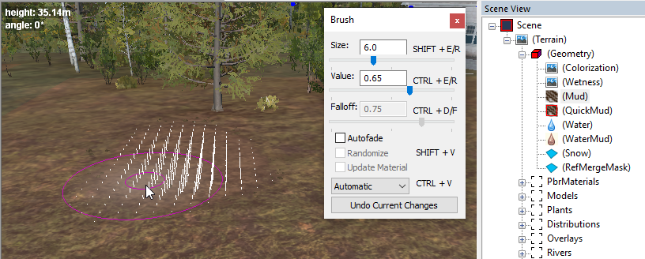

# Typical Brush Dialog

Brushes of various types are frequently used in the Editor. They allow you to add the mud, paint layers of the materials, paint distribution maps for plants, and so on. 

When you will be painting with a brush, the **Brush** dialog will appear within the main panel of the scene. The particular properties (modes of the brush, etc.) displayed in this dialog depend on the particular brush. 

However, most of the brushes look pretty similar:

Painting with the brush is typically performed by pressing and holding the right mouse button while moving the mouse. By pressing the left mouse button, you can apply the changes.

Typically, brushes have some universal settings:

-   **Size** – the size of the brush in meters.

-   **Value** – the force of the brush and the direction vector for changes after painting. It can be set to a negative value. For example, for a brush of heights, positive values ​​will raise the terrain up, negative values ​​will lower it.

-   **Falloff** – specifies the softness of the border of the brush. For example, `0` – a brush with absolutely hard edges, `1` – changes from the brush begin to fade immediately from the center of the circle of the brush.

-   **Autofade** – the automatic attenuation mode of the brush, that depends on the direction of the drawn line. Useful for drawing ruts and working with mud.

-   **Randomize** – a random spread of brush values ​​in a given range. That is, the brush will randomly change the values ​​of force and direction. Useful for creating chaotic unevenness.

**NOTE**: For some brushes, the range of the **Value** slider is from `0` to `1`. Typically, in this case, the brush will paint its content when the **Value** is greater than `0.50` and will remove its content when the **Value** is less than `0.50`. Please note that the default value for such brushes is typically `0.50` and the brush *will not do anything until you change this value*.

Typically, to apply your changes after using the brush, you left-click the terrain (or deselect the selected section in the **Scene View** panel) and rebuild the terrain. You can either turn on the **Enable autorebuild terrain** option on [Toolbar](./toolbar_buttons.md) or manually rebuild the terrain. To manually rebuild the terrain, right-click the scene window and select **Rebuild Terrain** or **Rebuild visible / Selection** (to rebuild only visible or selected areas).

**Undo Current Changes** in the **Brush** dialog – discards the current changes during painting, reverts all changes made after the most recent right-click.

The **(Geometry)** section with the **Scene View** panel contains a lot of brushes. For their descriptions, see [Geometry Brushes for Terrain](./../../creating_a_map/terrain/geometry_brushes_for_terrain/overview_main_geometry_brush.md) section and its subsections.

