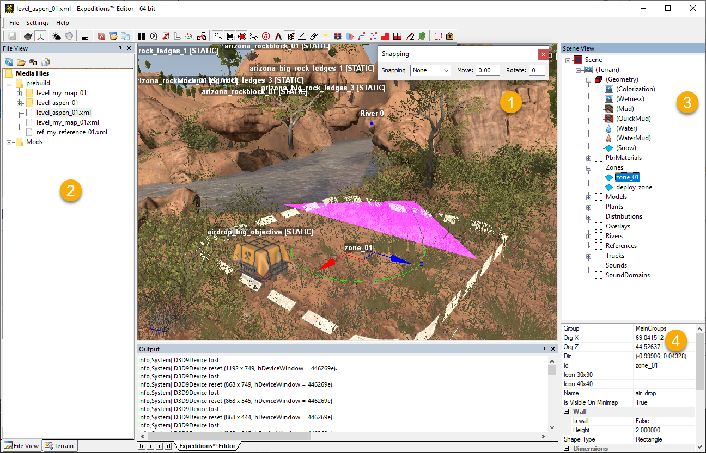
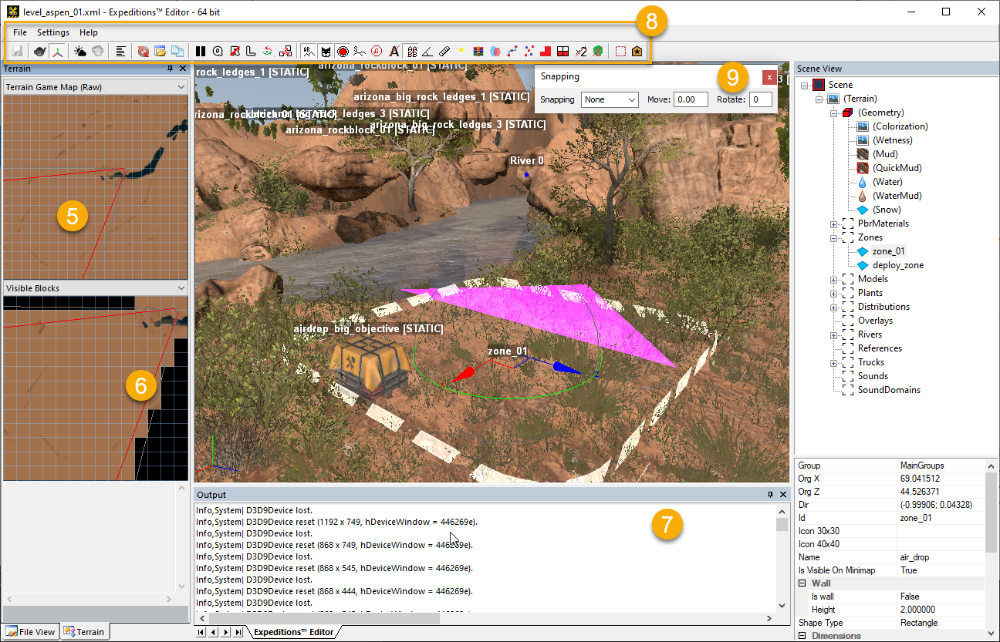

# UI Overview

*Expeditions Editor* and *SnowRunner Editor* have almost the same UI.

For both editors, the main UI looks like the following:

Where the main UI panels are the following:

1.  The **main panel (scene window)** – displays the part of your scene. Here you perform the main operations with the content of the scene: add new objects, move and rotate them, paint the terrain using various brushes, and so on.

2.  **File view** panel – this panel works as a library that contains all maps and references. Double-clicking the file in the panel will load the corresponding map.

3.  **Scene View** panel (upper part) – displays the list of objects on the scene. Objects can be selected both in the main panel (scene window) and using the **Scene View** list, after expanding its hierarchy. Along with objects, this hierarchy contains a set of various brushes in the **Scene \> Terrain \> [(Geometry)][geometry_brushes]** section.

4.  The lower part of the **Scene View** panel – this panel displays and allows you to modify the properties of a selected object.

5.  Minimap (the upper part of the **Terrain** panel) – displays the current view of the level minimap.

6.  The visible blocks section (the lower part of the **Terrain** panel) – displays visible blocks of the terrain, depending on the direction of the camera on the scene.

7.  Log (the **Output** panel) – All system messages and editor errors are displayed here.

8.  Above all these panels, the menu bar and toolbar are displayed.

9.  **Snapping** panel is displayed as a floating panel above the main window. For details on it, see [Snapping Panel](./snapping_panel.md).

[geometry_brushes]: ./../../creating_a_map/terrain/geometry_brushes_for_terrain/overview_main_geometry_brush.md