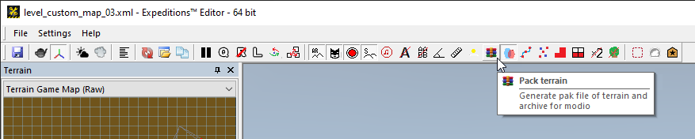

# Packing Maps

## Overview
To pack the map, you need to click the **Pack terrain** button () on the toolbar of the Editor.

This operation will pack an individual map (as a mod) as is performed the same way in both *Expeditions* and *SnowRunner*. The corresponding button exists in the corresponding Editors for both games.

**NOTE**: Packing is necessary for both [local testing][local_map_testing] of the map mod and [publishing][publishing_maps] of the map mod to mod.io after it.

## Generated Files
After packing, the system will create two sets of files:

-   set of `.pak` files – that are necessary for local testing.

-   set of `.zip` files – that are intended for uploading to mod.io.

After successful packing, the set of .pak files is automatically copied to the mods folder of the game, which will allow the game to find this map and display it in game UI. So, directly after packing, you can proceed to [local testing][local_map_testing].

The `.pak` files themselves can be found in the folder with local mods of the game, i.e. in the `Media\Mods` folder, which is created in the *folder of the game* within `Documents\My Games\` folder.

For example, the typical full path to this folder is similar to the following:

-   For *Expeditions*: `C:\Users\<name_of_user>\Documents\My Games\Expeditions\Media\Mods`

-   For *SnowRunner*: `C:\Users\<name_of_user>\Documents\My Games\SnowRunner\Media\Mods`

The `.zip` files generated for the packed map mods can be found in the `Media\levels` folder in the *folder of the game* within `Documents\My Games\` folder.

For example, the typical full path to this folder is similar to the following:

-   For *Expeditions*: `C:\Users\<name_of_user>\Documents\My Games\Expeditions\Media\levels`

-   For *SnowRunner*: `C:\Users\<name_of_user>\Documents\My Games\SnowRunner\Media\levels`

These .zip files can be uploaded mod.io sites of the games in a standard way.

## Expedition Specifics
Custom *Specialists*, *Base Modules*, and [*Inventory Items*][inventory_items] are packed differently.

Particularly, they can be packed from the dialog that opens after clicking the **EXP MODs creation** () button on the toolbar, using **File** \> **Pack** command in the main menu of this dialog.

Custom *Regions* with multiple interconnected maps are currently not supported in Expeditions. However, they will be for sure supported later, in the next versions of the game. Currently, only mods of standalone maps are supported.

## SnowRunner Specifics
Custom *Regions* with multiple maps are packed differently, see [Regions with Multiple Maps][regions].

And, in SnowRunner, you can pack your map for PC only and generate only the `.zip` package for PC, using the **Pack terrain for pc only** () button on the toolbar. This button is located next to the usual **Pack terrain** button () that generates all `.zip` packages. Typically, **Pack terrain for pc only** is used only when it is necessary to generate the local PC version of the map mod for [local testing][local_map_testing]. 

[local_map_testing]: ./testing_maps.md
[publishing_maps]: ./publishing_maps.md
[inventory_items]: ./../../custom_gameplay_entities/inventory_items/custom_inventory_items_overview.md
[regions]: ./../creating_a_map/regions/regions_with_multiple_maps.md