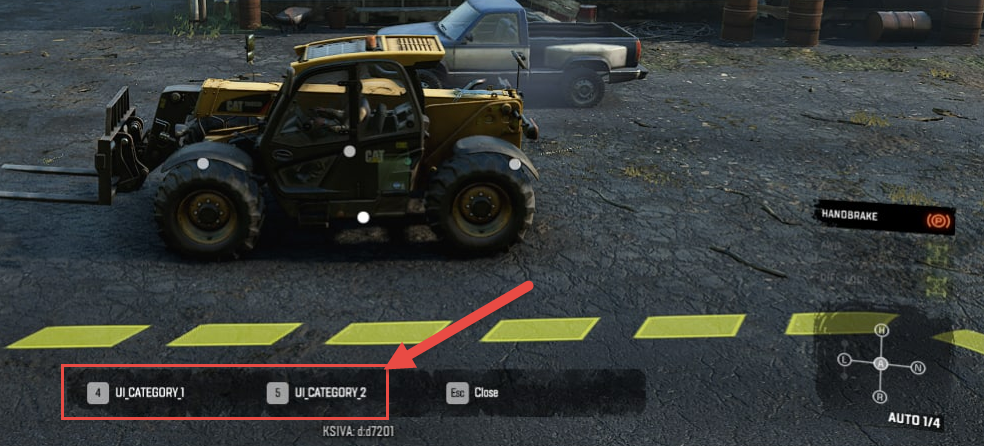

# Different Scenarios of Usage for ActionCategory Fields

*This section is not refactored yet. It will be checked and refactored later. Sorry for inconvenience. (`TBD`)*

As we stated above (see [17.1.2](#controls-for-controlled-constraints-of-an-addon)), the particular behavior of attributes of the \<ActionCategory\> tag may vary. I.e., the game will use the values of these attributes differently depending on the number of action categories used for the addon and whether or not are they working in FastMode.

Below is the list of different scenarios for that. They describe only the varying parts of the flow, for the description of all attributes of the \<ActionCategory\> tag please refer to see [17.1.2](#controls-for-controlled-constraints-of-an-addon).

**Scenario 1: All action categories are non-FastMode ones**

-   In the Functions menu, in the **OPERATE** subsection, the *main command corresponding to the addon usage* is displayed (only when the engine is started). The name of this command is formed by the fixed prefix (defined by the UI_CONTROL_ADDON string) +\
    the name of the addon taken from the XML class of the addon (the UiName attribute of the \<UiDesc\> tag there). E.g. \"**CONTROL {name of the addon}**\".

-   When the player selects this main command in the Functions menu, the game displays a set of UI buttons for all action categories at the bottom of the screen.\
    \
    \
    \
    The names of these UI buttons are defined by the LocaleUid values of these categories. The player can select one of these categories by pressing a button assigned to this category in its Action attribute.

**Scenario 2: All action categories are FastMode ones**

-   In the Functions menu, in the **OPERATE** subsection, the *list of commands* *corresponding to every action category* is displayed (only when the engine is started). The name of every command is defined by the LocaleUid values of the corresponding category. E.g. \"**CONTROL EVACUATOR**\".\
    The Action attributes of the corresponding categories need to be specified but are not used (they do not affect anything).

-   After selection of one of these commands, the game displays the controls of the corresponding action category in FastMode (see [17.1.1](#fastmode) above),

**Scenario 3: There are both FastMode and non-FastMode action categories**

-   If there is at least one non-Fast mode category, then in the Functions menu, in the **OPERATE** subsection, the *main command corresponding to the addon usage* is displayed (only when the engine is started). The name of this command is formed by the fixed prefix (defined by the UI_CONTROL_ADDON string) + the name of the addon taken from the XML class of the addon (the UiName attribute of the \<UiDesc\> tag there).\
    E.g. \"**CONTROL {name of the addon}**\".

-   When the player selects this main command in the Functions menu, the game displays a set of UI buttons for *all action categories (both FastMode ones and non-FastMode ones)* at the bottom of the screen. The names of these UI buttons are defined by the LocaleUid values of these categories. The player can select one of these categories by pressing a button assigned to this category in its Action attribute.

-   *Along with that*, in the Functions menu, in the **OPERATE** subsection, the game displays the *list of additional commands* *corresponding to every FastMode action category*.\
    The name of every such command is defined by the same LocaleUid values of the corresponding FastMode category.

