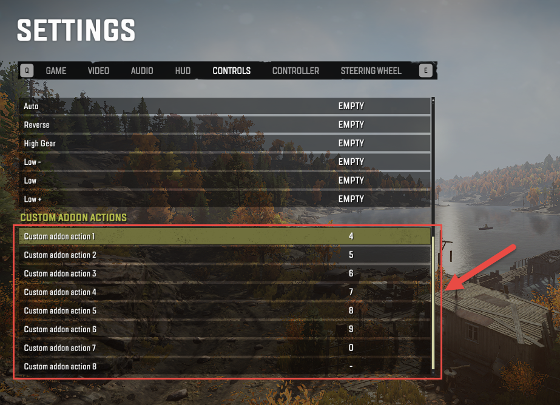

# Actions. Buttons for Controlled Constraints

*This section is not refactored yet. It will be checked and refactored later. Sorry for inconvenience. (`TBD`)*

When creating Controlled Constraints or Powered Constraints you can assign particular Actions to them (using the Action attribute of the \<Constraint\> tag, see [17.1.2](#controls-for-controlled-constraints-of-an-addon) above) or to the ActionCategories used for grouping them.\
\
**NOTE**: ActionCategories define the grouping of controls in general, they can be used not only for the controlled constraints. Powered Constraints are currently not described within this guide.

Every Action is identified by its number (from 1 to 14) and corresponds to the button or a pair of buttons that are used by the player for controlling the constraint:

-   Actions from **1** to **8** -- correspond to a ***single button***. They can be used for Powered Constraints or for selecting ActionCategories (see [17.1.2](#controls-for-controlled-constraints-of-an-addon) above) in the UI.

-   Actions from **9** to **14** -- correspond to a ***pair*** ***of buttons***. They can be used for Controlled Constraints.

For Actions from **1** to **8**, the particular button that is assigned to the Action can be changed in the SETTINGS of the game, in **SETTINGS \> CONTROLS \> CUSTOM ADDON ACTIONS**:

Actions from **9** to **14** correspond to the button pairs. Particularly, for every Action of such type, there are two buttons: so-called ***forward*** and ***backward***.

> **NOTE**: However, these names (***forward*** and ***backward***) are conventional, they do not necessarily correspond to these types of movement, their particular meaning is defined by the Controlled Constraint this Action is used for. E.g., for some constraint that uses Action 10, the button assigned to Action 10 (***forward***) can correspond to "*Extend"* and the button assigned to Action 10 (***backward***) can correspond to its opposite action -- "*Shorten"*. Please note that in the in-game UI, a single name (e.g. "*Extend"*, see LocaleUid above) will be displayed for both of these buttons.

Previously, buttons assigned to these Actions (from **9** to **14**) were predefined and had fixed values. However, starting with DLC 6 (*Season 6: \"Haul & Hustle\"*), these buttons can be also reconfigured by the player in **SETTINGS \> CONTROLS \> CUSTOM ADDON ACTIONS**, similarly to Actions from **1** to **8**:

However, the *default* buttons assigned to these Actions remain the same. You can see these default buttons in the table below.

  --------------------------------------------------------------------------------------------------------------------------------------------------------------------------------
  *Action \#\   *Subactions*   *PC*   *Xbox*             *PlayStation*                                                                                         *Nintendo Switch\
  *                                                                                                                                                            *
  ------------- -------------- ------ ------------------ ----------------------------------------------------------------------------------------------------- -------------------
  Action 9      *forward*      Q      Left Trigger       L2 button                                                                                             ZL button

                *backward*     E      Right Trigger      R2 button                                                                                             ZR button

  Action 10     *forward*      W      Left Stick Left    Left Stick Left                                                                                       Left Stick Left

                *backward*     S      Left Stick Right   Left Stick Right                                                                                      Left Stick Right

  Action 11     *forward*      A      **X** button        button   **X** button

                *backward*     D      **Y** button        button               **Y** button

  Action 12     *forward*      R      D-pad Up           Left Stick Up                                                                                         D-pad Up

                *backward*     T      D-pad Down         Left Stick Down                                                                                       D-pad Down

  Action 13     *forward*      F      D-pad Left         Left Stick Left                                                                                       D-pad Left

                *backward*     G      D-pad Right        Left Stick Right                                                                                      D-pad Right

  Action 14     *forward*      Z      Left Bumper        L1 button                                                                                             L button

                *backward*     X      Right Bumper       R1 button                                                                                             R button
  --------------------------------------------------------------------------------------------------------------------------------------------------------------------------------

