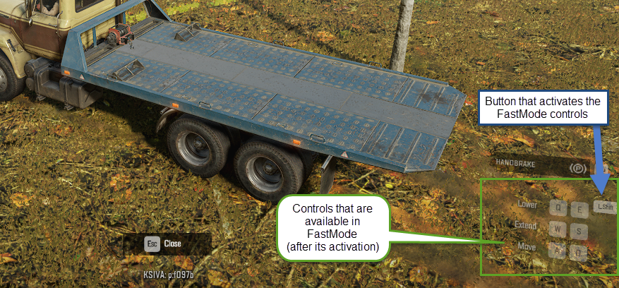
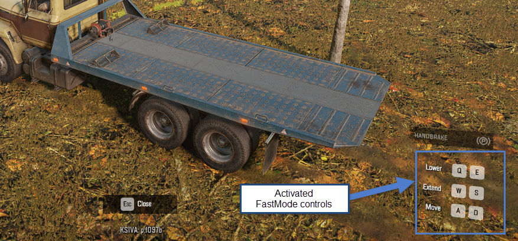

# FastMode

*This section is not refactored yet. It will be checked and refactored later. Sorry for inconvenience. (`TBD`)*

FastMode is a UI/Controls feature that allows the player to switch between the controls of the addon and the movement of the truck more efficiently, without entering the Functions menu every time when this switching is necessary.

For example, FastMode is used for the "Articulated Towing Platform" addon. If this addon is installed and you have activated its controls (by entering the Functions menu and selecting "CONTROL EVACUATOR" there), you will be able to switch between controls of the towing platform and controls of the truck itself by holding one button:

In the XML configuration of the addon, the FastMode is enabled for a set of controls using the AvailableForFastMode=\"true\" attribute of the \<ActionCategory\> tag, see the step 2 below in 17.1.2 section. Typically, this configuration is a part of the setup of the controlled constraints.

