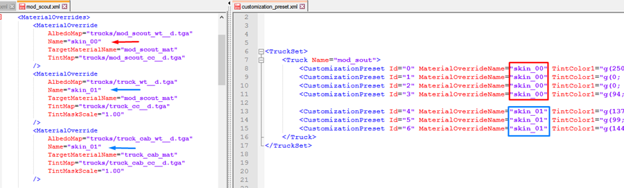

# Color Customization

This section provides general info on creating custom skins and colorization of your trucks and addons.

## Main Enities
Main entities that you will work with are the following:

-   **Override of the Material** – set by the [`<MaterialOverride`>](./../../tags_and_attributes_of_trucks/combinexmesh/materialoverrides/materialoverride/index.md) tag, the override that sets new values to a necessary number of parameters of a truck material. And, also, specifies the zones of this material where the custom colors will be applied (up to 3 colors).

-   **Customization Preset** – set by the [`<CustomizationPreset>`](./../../tags_and_attributes_of_trucks/truckset/truck/customizationpreset/index.md) tag, this preset allows you to assign a specific button in the Garage menu to replace the parameters of one or more materials of the track and its addons. And, along with that, it sets particular color tints for three layers of paint customization.

**NOTE**: For the detailed description of tags of these entities (their attributes and parent tags/files), please refer to the corresponding topics in the [**Tags and Attributes of Trucks**](./../../tags_and_attributes_of_trucks/index.md) section. The links to main tags are in the list above.

## The Process
The main process of creating a new type of color customization is the following:

1.  Visually define the areas where you want to perform repainting.

2.  Find all the materials of the truck and its addons that should be repainted upon a selection of a single button in the Garage menu.

3.  For every material found on the step #2 above, create its own `MaterialOverride` block with the necessary parameters.

4.  Specify the same value of the `Name` attribute to all the overrides of the materials from the step #3 above.

5.  For every set of colors you want to use for painting, create its own customization preset (`CustomizationPreset`).

6.  Specify the name from the step #4 above as the value of the `MaterialOverrideName` attribute for all created customization presets (`MaterialOverrideName == Name`). These presets will change the paint color for this set of overridden materials.

## Sample of Customizations
You can create several customizations, where each customization will override a certain number of materials. For example, you can both repaint the truck and draw an airbrushed image on it. And, you can implement it as two different customizations. After that, you can create several color presets for each of these customizations, to get the desired number of coloring options for each customization as a result. That is, you will get several different color options for repainting the truck and several color options for its airbrush image. And all of these options will be available in the Garage.

For example, we can configure two customizations (named `skin_00` and `skin_01`) as shown in the screenshot below:

As you can see, we override the materials of the truck in the `skin_00` customization and the materials of both the truck and the truck cabin in the `skin_01` customization. For `skin_00`, we create 4 different color presets. For `skin_00`, we create 3 different color presets.  
As a result, we will have 7 color customization buttons in the Garage. The first 4 buttons will correspond to 4 different color options of `skin_00`. The last 3 buttons will correspond to 3 different color options of `skin_01`.
