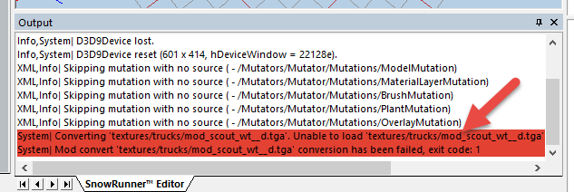

## 11.4. Viewing Errors

If the **Settings \> Ignore warnings** option is not selected in the main menu of the Editor, errors will be displayed to the user as pop-up windows.

Along with that, errors are displayed to the user in the log within the **Output** panel.

You can select errors there and copy them to buffer by pressing CTRL+C, then paste where necessary by pressing CTRL+V.

