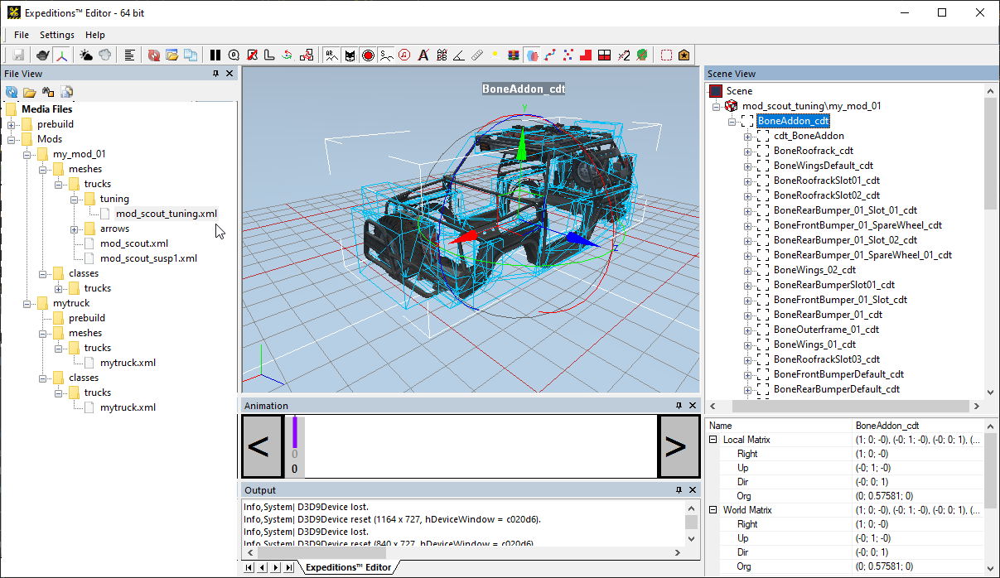

# Viewing XML files of Meshes for Other Objects

Using Editor, you can open XML files of meshes and view FBX files not only for trucks, but also for plants, the driver, and so on. 

For example, in *SnowRunner*, you can open the XML file of the mesh of the bumper and view its FBX model.

Or, in *Expeditions*, you can open the all-in-one XML file of the mesh of the addons that has now a [*single FBX*][addon_changes]:

The XML file of the *class* can be opened for trucks only.

[addon_changes]: ./../../new_features/addon_changes.md