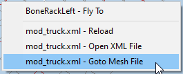

# Viewing XML file of the Class

When you open the XML file of the class of the truck, it is opened in the new **Truck** tab in the Editor:

The panel on the left side displays some options that can be useful while working with a truck:

-   **Activate attachments** options - allow you to enable/disable the lights that are described in the XML of the truck.

-   **Visualization** options - allow you to visualize some objects that are not related to lights or the physical model. For example, you can visualize the Damage Areas of the truck by enabling the corresponding option.

-   **Cabin** option - allows you to view the cabin of your truck in the high-poly mode.

The **Scene View** panel on the right displays the whole hierarchy of the truck skeleton with the CDT objects. It works the same way as when viewing the XML-mesh of the truck (see above).

Using this preview of the truck, you can also enable its Havok simulation. To do this, click the  button on the toolbar of the editor.

After doing this, the truck will be displayed as if it is placed on the ground.

The preview of the XML class of the truck allows you to quickly proceed to viewing the XML mesh of the truck. To do this, right-click somewhere in the main panel and select **Goto Mesh File**.

