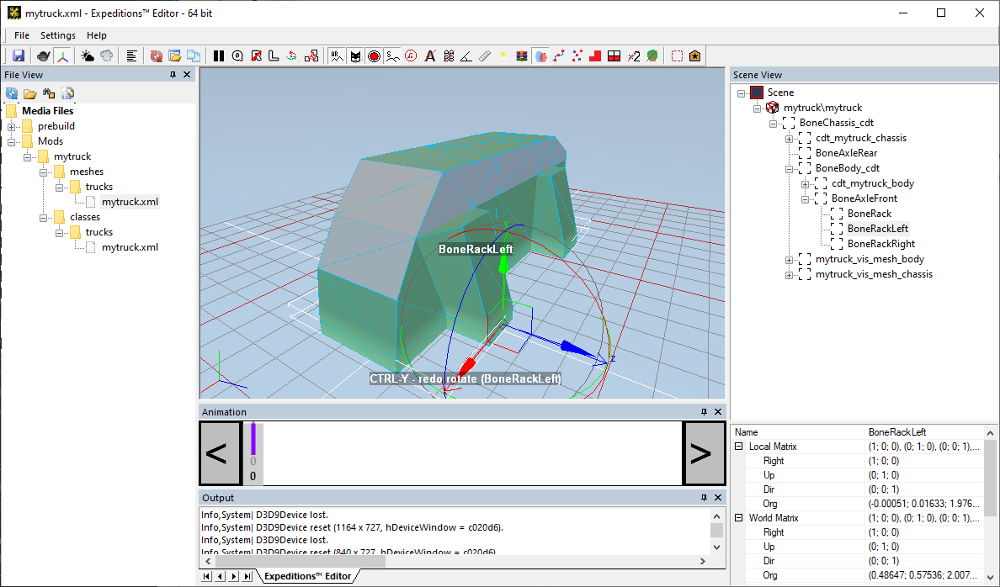
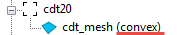

# Viewing XML file of the Mesh

If you open the XML file of the mesh of the truck, you will see the contents of the FBX file with applied textures.

Here you can quickly check the opened model for correctness.

In the **Scene View** panel, you can see the whole hierarchy of the truck skeleton with the CDT objects. If you select an object there, it will be displayed in the main panel and its properties (coordinates, etc.) will be displayed at the lower part of the panel.

Next to the name of the collision object, you can see how the form of this collision object is interpreted by the game engine:

The best such form is the "box"; however, "convex" is also suitable; the "mopp" value here means memory optimized partial polytope ([[Havok]](https://cgl.ethz.ch/teaching/former/seminar02/papers/Havok_Overview.pdf) term), which seems to be better than "convex". 

If the object is marked as "non-convex", it may cause some issues. For details, see [Physical Bones and Collision Meshes](./../../general_info/fbx_file_structure/physical_bones_and_collision_meshes.md#collision-meshes).

