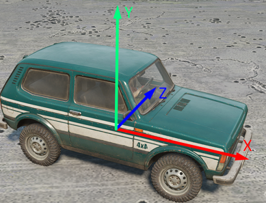
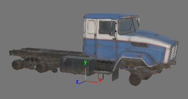
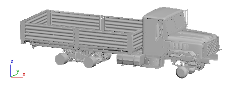
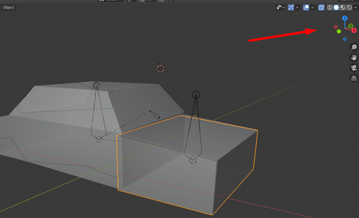

# Coordinate axes

In the game, the truck is oriented **along** the **OX** axis. The **OY** axis is pointing **up**. The **OZ** axis is pointing to the **left**.



This orientation corresponds to the (x, y, **-z**) axes in Maya:



And, in 3DS Max, to the (x, **z**, **y**) axes:



In Blender, the axes are the same as in 3DS Max. So, the orientation of the game corresponds to the (x, **z**, **y**) axes orientation in Blender:



Thus, to correctly export your truck to the FBX file from your 3D editor, the forward axis of your truck should be looking in the direction of the **OX** axis during the export.

Moreover, after exporting, when you will be specifying truck properties in XML, you should take into account the difference in the orientation of the axes, which was described above.

*For example:*

1.  The coordinates of the center of the wheel of your truck in Blender or 3Ds Max or  are `(1; 2; 3)`.

2.  So, in *the XML description* of this wheel, you need to specify `"(1; 3; 2)"` as the value of the `Pos` attribute:

    ```xml
    <Wheel
        Pos="(1; 3; 2)"
        ...
    />
    ```

**TIP**: For details on the recommended process of exporting from Blender, see [Step 2: Exporting to FBX](./../../getting_started/simple_truck_mod_from_scratch/step_2_exporting_to_fbx.md) of the [Simple Truck Mod from Scratch](./../../getting_started/simple_truck_mod_from_scratch/overview.md) tutorial.


