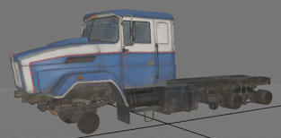
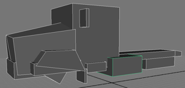

# FBX File Structure: Overview

Both *Expeditions* and *SnowRunner* use the FBX format to store information about the geometry, skeleton, and collision meshes of a truck, trailer (for SnowRunner), addon, or a wheel.

Geometry:  

Skeleton:  

Collision meshes:  

**TIP 1**: The FBX file created in the [Simple Truck Mod from Scratch](./../../getting_started/simple_truck_mod_from_scratch/overview.md) tutorial will allow you to examine the simple version of the FBX file structure.

**TIP 2**: Passing the [Sample Mod by the Game](./../../getting_started/sample_mod_by_the_game/overview.md) tutorial will give you with more sophisticated and professional FBX file of the truck. 

