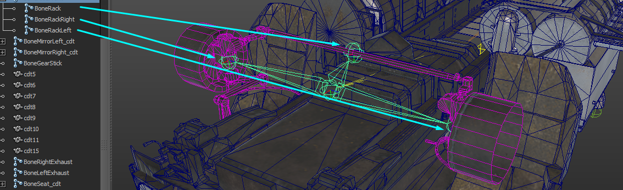
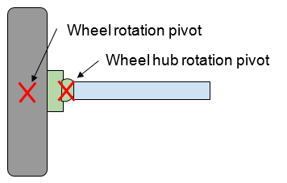
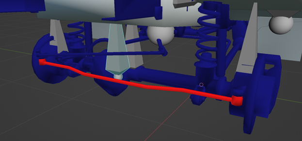
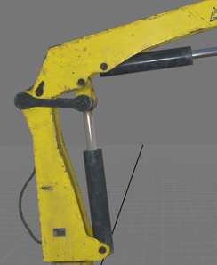
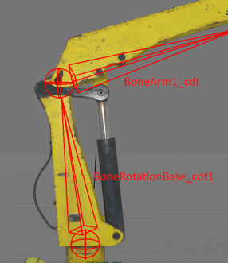
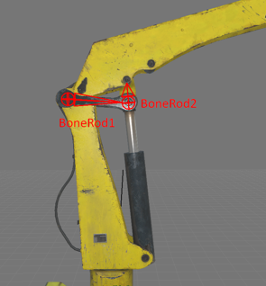
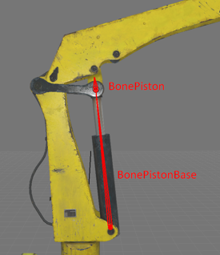

# Non-Physical Bones

## Overview
The behavior of non-physical bones is not directly related to Havok physics. 

However, their behavior depends on:
-   either the position of the physical or non-physical bones that they are attached to
-   or, the position of the wheels

Non-physical bones do not have collision meshes. And, they cannot affect the behavior of the bones of the physical model.

## Non-Physical Bones of the Model
Some frequently used non-physical bones are listed in subsections below.

### Axles
Every truck axle is modelled as non-physical bone. 

For a dependent suspension, the position of the axles along the `OY` axis is calculated as an average between the two nearest wheels. The rotation angle is calculated from the vector connecting these wheels.

If the `Y` coordinate of the axel bone does not coincide with the coordinate of the nearest wheel described in the XML of the truck, then you can get the unexpected result in the game. In this case, the bone will be located between the wheels and the skinned mesh will be deformed.

**TIP**: For a simple illustration of creating bones of axles, see [Step 1: Creating 3D Model][step_1] of the [Simple Truck Mod from Scratch][tutorial] tutorial.

**NOTE**: In the XML description of the truck, every axle of the truck is described by the [`<Axle>`][axle] tag. 

### SteeringRack

The steering rack *always* consists of three bones: 

-   The bone of the Rack
-   The bone of the Left Hub
-   The bone of the Right Hub

The behavior of every bone (of hubs and the rack) is controlled by the rotation of the wheel that is closest to it.

The bone of the rack moves along the arc calculated from the position of the nearest wheel and the length of the rack itself. Half of the length of the rack is specified in the XML of the truck by the value of the `RackHalfSizeZ` attribute of the [`<SteeringRack>`][steeringrack].

Hub bones rotate with the nearest wheels. However, the rotation pivot of the hub does not match the rotation pivot of the wheel. 

Therefore, the wheel should not just rotate, but also move along the circle circumscribed around the attachment point of the hub. The parameter `SteeringJointOffset` in the [`<Wheel>`][wheel] tag in the XML of the truck is responsible for this offset.

**TIP**: For a simple illustration of creating bones of the steering rack, see [Step 1: Creating 3D Model][step_1] of the [Simple Truck Mod from Scratch][tutorial] tutorial.

The process of rigging a regular (dependent) suspension is rather straight-forward. Typically, you simply attach the corresponding steering rack mesh to the bone of the rack with `1.0` weights.

If the truck has an independent suspension (there is no common rack), then the bone of the rack still needs to be created – to ensure the correct behavior of the hubs. And, since all bones must have skin modifiers, you also need to add this bone to the skin modifier of any mesh of the truck. I.e., you need to [skin at least one vertex to this bone][rigging_info].

The process of rigging an independent suspension is complicated and typically involves usage of inverse kinematics for moving parts of the racks and suspension arms. However, this setup probably deserves a separate topic. 

### AutomaticIK

Bones involved in inverse kinematics are also non-physical.

As an example, let's examine a setup of the hydraulics of the crane.

Here, only two bones are involved in physics: `BoneRotationBase_cdt`, `BoneArm1_cdt`.

To implement the operation of a hydraulic piston, we need two chains of bones with inverse kinematics: 

-   Chain 1: `BoneRod1` and `BoneRod2`
-   Chain 2: `BonePistonBase` and `BonePiston`.

 

*Chain 1:*  
`BoneRod1` is attached to the `BoneRotationBase_cdt` by the Hinge constraint.

`BoneRod2` is attached to the `BoneRod1` by the Hinge constraint. 

And, the locator (in Maya terms) of inverse kinematics is attached to the `BoneArm1_cdt` bone. 

Thus, their behavior is completely determined by the position of the physical bones.

*Chain 2:*  
The hydraulic piston is organized similarly. 

However, in its case, the inverse kinematics locator is attached not to the physical bone, but to the bone from the Chain 1 – `BoneRod2`.

**TIP**: For details on describing inverse kinematics chains in XML, see [`<AutomaticIK>`][automaticik], [`<IKBone>`][ikbone], and [`<IKJoint>`][ikjoint].

### Shakers
Some non-physical bones are described in the XML of the truck as "Shakers". 

They are needed, for example, to rattle the exhaust pipe or to provide a vibration of a running engine.

**TIP**: For details on describing "Shakers" in XML, see [`<Shaker>`][shaker].

### Rotators
Non-physical bones can be alos described in the XML of the truck as "Rotators". 

They are typically used to rotate the fan or the emergency light bulb.

**TIP**: For details on describing "Rotators" in XML, see [`<Rotator>`][rotator].

[wheel]: ./../../tags_and_attributes_of_trucks/truck/truckdata/wheels/wheel/index.md
[steeringrack]: ./../../tags_and_attributes_of_trucks/truck/truckdata/steeringrack/index.md
[rotator]: ./../../tags_and_attributes_of_trucks/truck/rotator/index.md
[shaker]: ./../../tags_and_attributes_of_trucks/truck/truckdata/shakers/shaker/index.md
[automaticik]: ./../../tags_and_attributes_of_trucks/truck/automaticik/index.md
[ikbone]: ./../../tags_and_attributes_of_trucks/truck/automaticik/ikbone/index.md
[ikjoint]: ./../../tags_and_attributes_of_trucks/truck/automaticik/ikbone/ikjoint/index.md
[rigging_info]: ./required_bones_and_rigging.md#rigging
[step_1]: ./../../getting_started/simple_truck_mod_from_scratch/step_1_creating_3d_model.md
[tutorial]: ./../../getting_started/simple_truck_mod_from_scratch/overview.md
[axle]: ./../../tags_and_attributes_of_trucks/truck/truckdata/axles/axle/index.md