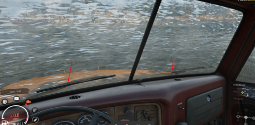

# Special Meshes

Every truck with a cabin has the `_windshield` and `_cockpit` meshes.

## `_windshield` mesh

This mesh corresponds to the windshield and other car glasses that are visible from the first-person camera. 

This mesh is a duplicate of the glasses that are visible from the outside, with the inverted normals. 

In addition, this mesh is made a bit more high-poly, since water and dirt stick to the glass on a per-vertex basis.

## `_cockpit` mesh

This mesh corresponds to the water cut-off area. 

The image below shows a poorly configured `_cockpit`. Arrows show the parts of the wipers that are inside the `_cockpit` mesh. Visually, they seem to be inside the cabin.

