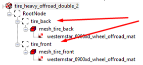

# Wheel as Set of Tires and Rims

If a wheel is set up as a set of tyres and then the setup of the wheels should be performed as follows:

A single FBX file contains either one or two tires, or one or two rims. When geometry is created for the wheels that are single for all axes of the truck (as on most scouts), then the FBX file will contain only one tire (named "tire") or only one rim (named "rim"). In the case of twin wheels (typically, rear wheels of a truck), the FBX file will contain two tires or two rims.

Sometimes, the vehicle has mixed types of wheels. E.g., the truck can have twin rear wheels and single front wheels.

In this case, the FBX contains both geometry of the single wheel tire (rim) named as `tire_front` (`rim_front`) and the twin wheel geometry named as `tire_back` (`rim_back`).

**NOTE**: For this scenario, these names (`tire_front`/`rim_front` and `tire_back`/`rim_back`) for these elements are strictly necessary, since this allows the system to correctly determine the type of the wheel and use the same tread pattern or disk geometry during customization.

XML of the mesh contains only the information on the materials.

XML of the class contains a description of characteristics of all tires and rims that are available within this type of wheel.

