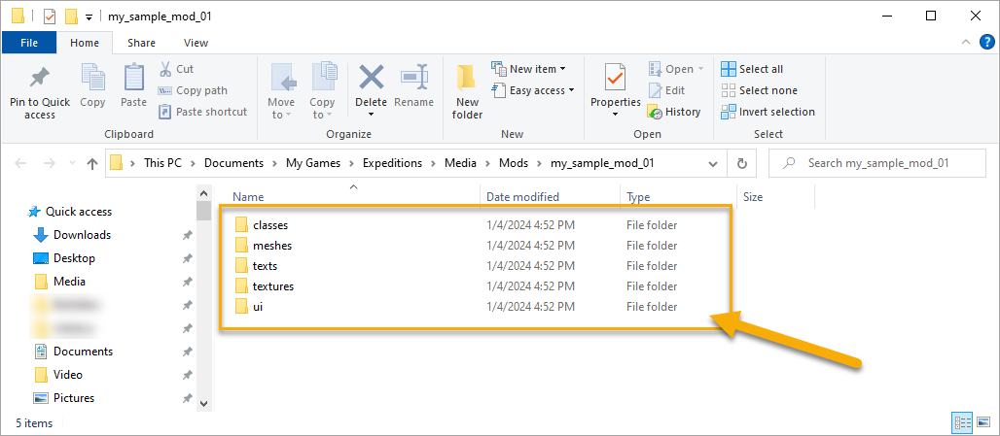

# Step 2: Creating Sample Mod

While being on the "Proving Ground" map, you can create a default sample mod, view its contents, and modify it as necessary.

To do that:

1.  Click **Add Mod** in the **TOOLS** menu, to start creating your mod.

2.  In the appearing dialog, specify the name of your mod and click **Create**.

    **NOTE**: Please, use only Latin characters (`Aa`-`Zz`), digits, and underscores (`_`) for the name of your mod.

3.  After doing this, the files of the new mod will be created at the following path:

    -   For *Expeditions*: `...\Documents\My Games\Expeditions\Media\Mods\<name_of_the_mod>`
    -   For *SnowRunner*: `...\Documents\My Games\SnowRunner\Media\Mods\<name_of_the_mod>`

    The game will automatically open the created folder of the mod for you. This folder will contain all source files of the sample mod, grouped by standard subfolders: `classes`, `meshes`, `texts`, `textures`, and `ui`.

    *Sample Mod Files in Expeditions:*
    

4.  Now, you can browse these files and, if necessary, modify them too. Some modifications can result in errors and can make the sample mod incorrect, but you can always generate another sample mod instead by repeating steps 1-3 above. 

5.  After you have finished browsing or the modification of the files, click **Reload** in the **TOOLS** menu.

However, to be able to spawn this mod vehicle, you need to convert these source files – see [Step 3][step_3].

**TIP**: If you want to create your own new mod (not based on the sample), you should create its mod folder also in the `...\Media\Mods\` directory. The created folder should contain all source files of this mod. To make this mod a working one, you can perform all operations described in this tutorial with this mod – particularly, [conversion of resources][step_3], [spawning][step_4], and [packing][step_5].

[step_3]: ./conversion_of_resources.md
[step_4]: ./spawning_mod_vehicle.md
[step_5]: ./packing_vehicle_mod.md

