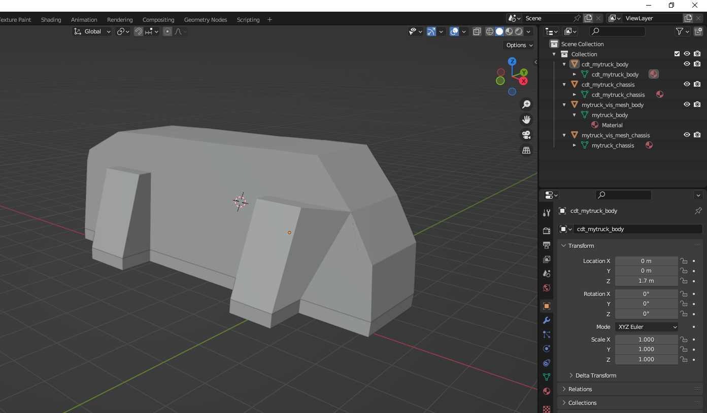
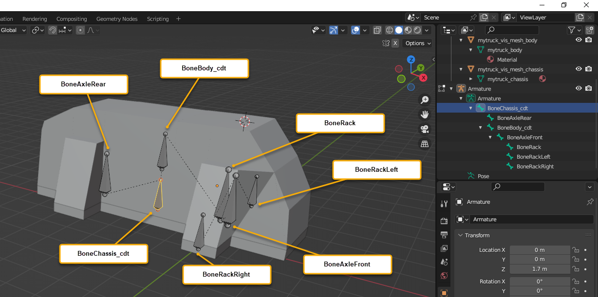
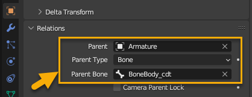
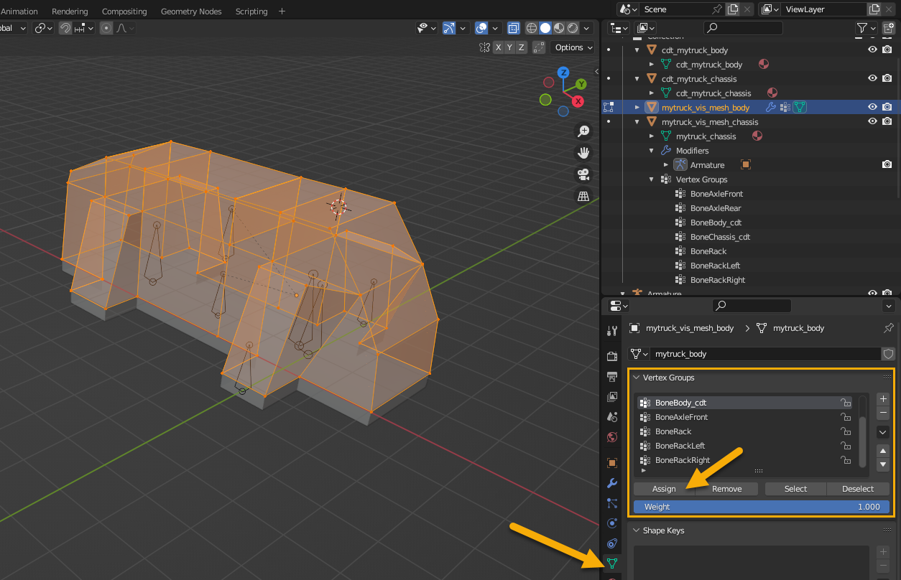
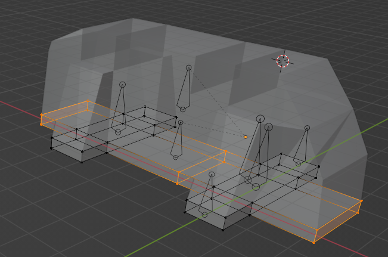
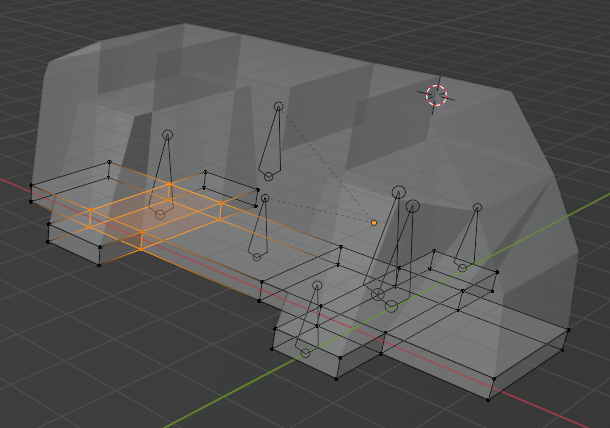
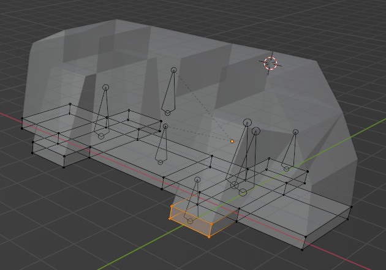
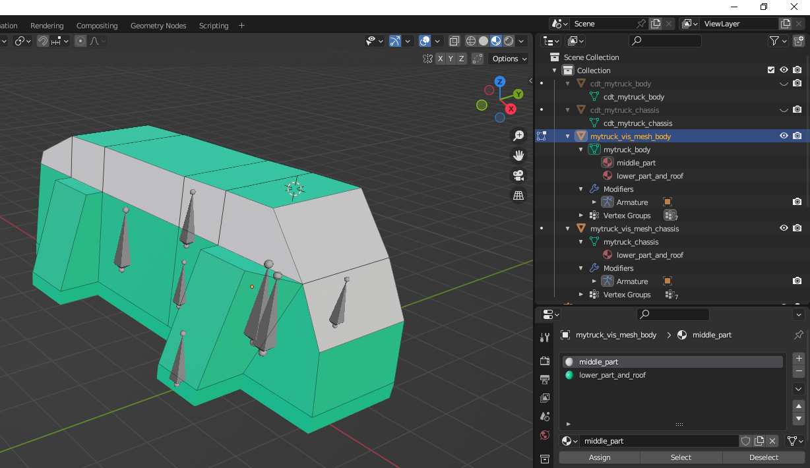

# Step 1: Creating 3D Model
First of all, you need to create a model for your truck. 

This model should contain:

-   **Visual meshes** – They will be responsible for the visuals of your truck and will be rendered.
-   **Collision meshes** – They will be used for collisions in the physics engine and, beeing attached to physical bones, will be described along with them as physical bodies in the `<PhysicsModel>` of your truck.
-   **Skeleton**, consisting of physical and non-physical bones – **Physical bones**, along with their collision meshes, will be physical bodies of the model, see above. **Non-physical bones** will not directly participate in the physics simulation. However, non-physical bones will be a part of the bone hierarchy, will be attached to other bones, and their position will be affected by the position of other bones or wheels.      

**NOTE**: The 3D model of our truck should be modelled *without the wheels*. Wheels are the separate entity. I.e., you can either use wheels from the predefined set (as we will do) or model your own wheels.

## Visual Meshes
Visual mesh or a set of visual meshes is created in a regular way. But, at this stage, it is necessary to warn you about not using too much polygons for your model, see the note below.

**NOTE**: Approximate values of polycount for different parts of the truck model are the following:

-   External part of the truck (without wheels) – up to `60К` triangles and not more.
-   High-res interior of the truck (for the cabin view) – up to `40К` triangles and not more.
-   Other elements (including wheels, visual customization, etc.) – up to `60К` triangles and not more.

However, since we are creating a simple mod, let's keep our model as simple as possible:



As you can see, we have created two visual meshes: one for body of the truck and one for its chassis. We will omit instructions for creating them in Blender, since creation of these visual meshes requires only the most basic knowledge of Blender. 

**NOTE**: If you wonder, how to create these or similar meshes in Blender you can start with some short intro to Blender similar to [**Blender 2.80 Fundamentals**](https://www.youtube.com/watch?v=MF1qEhBSfq4&list=PLa1F2ddGya_-UvuAqHAksYnB0qL9yWDO6) or other tutorials. The creation of the model shown above _really_ requires only the basic tools, like [Extrude](https://www.youtube.com/watch?v=2qD_tcPMhOs&list=PLa1F2ddGya_-UvuAqHAksYnB0qL9yWDO6&index=12) and [Loop Cut](https://www.youtube.com/watch?v=-pCf3DjsEBg&list=PLa1F2ddGya_-UvuAqHAksYnB0qL9yWDO6&index=13), along with selecting and moving faces, edges, and vertices.

Along with visual meshes, we have created two collision meshes for both of these parts, since both of them will be physical. Actually, we have created collision meshes by duplication of the visual meshes, since they have a very low amount of polygons too.

If we were creating a professional mod, we would also create meshes of the cabin interior (highpoly `hp_cab` and lowpoly `lp_cab`), `_windshield` and `_cockpit` meshes, meshes for mirrors, and so on. But we will omit them here for simplicity.

Since we will not create cabin meshes, the Cabin View of the camera will not be working for our mod. And, since we are not creating the small landmark mesh for the mini-map, our mod will be displayed there as a default vehicle. But, anyway, your first mod can be surely created without them.

## Bones
Now, we need to create the hierarchy of bones for our model.

We need at least two physical bones for the body of the truck and its chassis, since they are will be our physical bodies. Since all physical bones must have collision meshes attached to them, their names typically should have the `_cdt` suffix to highlight that, e.g. `BoneChassis_cdt` and `BoneBody_cdt`. 

Along with it, we need a set of non-physical bones for, at least:

-   **Axles** – Here we need 2 bones: for front and rear axles correspondingly.
-   **Steering Rack** – The steering rack must always consist of the 3 bones: the bone of the rack, the bone of the left hub that will be attached to the left wheel, and the bone of the right hub that will be attached to the right wheel. 

In a professional mod, we would also create a set of bones for inverse kinematics (`<AutomaticIK>`) to make the movement of the truck more realistic on the rugged terrain and a bone plus a mesh for the steering wheel (`<SteeringWheel>`), but we will omit them here.

**NOTE**: In the final FBX, we will *not* need the Armature and we will exclude it during export (see below). But, in Blender it is required for adding bones, so the source Blender file will have it anyway. It will appear automatically when you add the first bone to the scene.

Bones that we are creating must have some hierarchy. And, importantly, there must be **only one root bone** in this hierarchy.

For example, in our case, we can make the `BoneChassis_cdt` the root bone of our truck and create the hierarchy similar to the following:

```text
- BoneChassis_cdt             (physical bone of the chassis)
    - BoneAxleRear            (non-physical bone of the rear axle)
    - BoneBody_cdt            (physical bone of the truck body)
        - BoneAxleFront       (non-physical bone of the front axle)
            - BoneRack        (non-physical bone of the steering rack itself)
            - BoneRackLeft    (non-physical left hub that will be attached to the left wheel)     
            - BoneRackRight   (non-physical right hub that will be attached to the right wheel)    
```


This hierarchy seems rather natural and we will use it for our truck.

**NOTE**: It is a good idea to make the positions of some bones symmetrical. To specify position of bones precisely, you can use Blender's [3D Cursor](https://docs.blender.org/manual/en/latest/editors/3dview/3d_cursor.html) tool and its snapping mechanics (SHIFT + S opens the snapping menu). You do it similarly to instructions here: <https://blender.stackexchange.com/questions/8756/how-can-i-position-bones-in-a-model-easily-and-precisely> (it's a guide for the old version of Blender, but the main principles are the same).


## Collision Meshes
Every physical bone must have a collison mesh attached to it.

Along with creation of visual meshes (see above), we have already created 2 collision meshes: one for body of the truck and one for its chassis. We did this just by duplicating the visual meshes, since they are very low-poly.

Please note, that names of collision meshes must start with the `cdt_` prefix, e.g. `cdt_mytruck_chassis` or `cdt_mytruck_body`.

## Attaching Collision Meshes and Visual Meshes to Bones
Since we have created bones, it's time to attach collision meshes and visual meshes to these bones. 

Please note that attachment of collision meshes and visual meshes will be done differently.

### Parenting of Collision Meshes
Let's start with collision meshes. For them, we need to attach `cdt_mytruck_chassis` to `BoneChassis_cdt` and `cdt_mytruck_body` to `BoneBody_cdt`.

Collision objects should be parented to physical bones as a whole, without skinning. Here is one of the ways to do it (in Blender 3.6.2):

1.  In the Edit Mode or Pose Mode, select the target bone of the skeleton which you want to attach the `cdt_...` node to. E.g., you can select the `BoneBody_cdt` bone.
2.  Switch to the Object Mode, select the `cdt_...` node you want to attach (e.g. `cdt_mytruck_body`) and then, while holding CTRL to keep it selected, click the Armature.
3.  Press CTRL+P and then **Bone** or select **Parent > Bone** from the **Object** menu.

If you have done it correctly, then, in the Pose Mode, the cdt mesh will move along with the target bone. And, in the Object Mode, the **Object > Relations** in properties of the `cdt_...` node will look similar to the following:



### Skinning of Visual Meshes
Now, let's attach visual meshes to bones. 

Speaking more precisely, visual meshes should be *skinned*, i.e. parented to the bones of the truck with weights (you can see Blender's [Vertex Groups](https://www.youtube.com/watch?app=desktop&v=dKZrzG5r13g) video as an introduction to this).

For professional modes, this process should be accurate, since some parts of the visual mesh are skinned simply, by assigning weights related to a single bone, and other parts (e.g. springs) require more precise skinning, with weights assigned to multiple bones. In our example, we will try to keep it simple.

We will start with parenting visual meshes to Armature *with empty Vertex Groups*:

1.  In the Object Mode, select the target visual mesh. E.g. `mytruck_vis_mesh_body`. Or, `mytruck_vis_mesh_chassis`.
2.  While holding SHIFT, click one of the Armature's bones in the viewport to select the Armature too.
3.  Press CTRL + P and select **Armature Deform > With Empty Groups** or select the similar option from the **Object > Parent** menu. 

After repeating this for both visual meshes, you will assign both of them to the Armature and create Vertex Groups for them, but these groups will be empty, i.e. there will be no vertices in them and, correspondingly, no weights.

Now, we need to add vertices to them and add weights to these vertices.

First, let's assign weights to the body mesh of the truck. Typically, it will not deform and, for the whole body mesh, we will assign `1.0` (or `100%`) weight to the `BoneBody_cdt` bone.

To do this:

1.  In the Edit Mode, select *all* vertices of the `mytruck_vis_mesh_body` mesh. (You can do it easily by enabling the **X-Ray** option before the selection).
2.  Within the **Data > Vertex Groups** panel, ensure that the **Weight** slider is set to `1.000`, select BoneBody_cdt in the list of **Vertex Groups** and click **Assign**.

    

3.  To ensure that the mesh is fully skinned, switch to the **Weight Paint** mode. If all is good, the mesh will be fully red.

Second, we need to assign weights to the chassis mesh. In professional mods, it has springs that should be deforming, etc. 

However, we will keep it simple:

-   For its main part, we will assign most of the weight to the `BoneChassis_cdt`.
-   But, also, we will deform the axle parts along with the `BoneAxleFront` and `BoneAxleRear`.
-   And, finally, the parts that are close to the front wheels will be linked to `BoneRackLeft` and `BoneRackRight` hubs with `1.0` weight.

Since our model has rather small amount of vertices, we will use the same mechanics of selecting vertices and assigning weights instead of weight painting. However, you can try it the other way, if you want to.

1.  At first, we will select the longitudinal vertices of the chassis, except the ones closer to axles. These vertices we will assign to **BoneChassis_cdt** vertex group with `1.0` weight.

    .

2. Then, we will select vertices in the middle, closer to the rear axle, and add them to 2 vertex groups: **BoneChassis_cdt** with `0.5` weight and **BoneAxleRear** with `0.5` weight. We will do the same with similar vertices closer to the front axle. 

    

3.  Then, we will add vertices of the "right wheel hub" to **BoneRackRight** vertex group with `1.0` weigth. The same should be done for "left wheel hub" and **BoneRackLeft**.

    

4.  Finally, we will switch to **Weight Paint** mode and browse the vertex groups to ensure that assigned weights are correct. For example, for **BoneChassis_cdt** the weights will look similarly to the following:

    

Now, we are done with skinning and can add textures to our model.

## Materials for 3D Model
Now, we need to add textures to our truck. 

However, we should keep in mind that the system takes only *names* of textures from the FBX file, i.e., names of materials assigned to particular parts of the truck. 

**NOTE**: The textures *themselves* should be added to modding files separately, as `.tga` files. The XML file of the mesh of the truck, which we will add later on, will work as mapping table between the name of the material in the FBX file and corresponding `.tga` files of textures, and, along with that, will provide cofiguration of truck's materials. 

For simplicity, we will use only two materials for the truck model and will make the textures as simple as possible – we will use 2 color fills as textures. This will allow us to omit the part of work related to UV maps that are necessary to wrap the truck with textures correctly. However, for professional mods, this part is required and, as an introduction to this topic, you can start with Blender's [official help]( https://docs.blender.org/manual/en/latest/editors/uv/introduction.html) or introductory video on [UV Unwrapping](https://www.youtube.com/watch?v=Y7M-B6xnaEM&list=PLa1F2ddGya_-UvuAqHAksYnB0qL9yWDO6&index=19).

So, in Blender we need to create two materials, one for the middle part of the truck (`middle_part`) and one for the lower part and the roof (`lower_part_and_roof`). And [assign](https://docs.blender.org/manual/en/latest/render/materials/assignment.html#material-slots) these materials to necessary faces of our visual meshes.

**NOTE**: Names of these materials must adhere the common naming scheme. They can contain only Latin characters and digits and must have no special characters (except "_"). There must be no spaces in these names. 

For example, our preliminary coloring with materials can look like this:



That's it, since now we need only the names of these materials and their assignment to necessary parts of the model. We will create the textures themselves later on.

## Ensuring Scale and Rotation Requirements

Now, we are amlost ready for exporting to FBX. But, before exporting we need to ensure that the requirements to 3d model are met.

Particularly, we need to ensure that:

-   All our meshes have _identity scale_. I.e., in Blender, their **Scale** needs to be `(1, 1, 1)`.
-   The root bone of the truck (e.g. `BoneChassis_cdt`) and all its meshes have _identity rotation_. I.e., in Blender, their **Rotation** needs to be `(0, 0, 0)`.
-   The truck is oriented correctly, i.e. the forward axis of the truck is looking in the direction of the `OX` axis and, in Blender, the `OZ` axis of the truck is looking up. 

After we have ensured that these requirements are met, we can proceed to the next step – [exporting to FBX](./step_2_exporting_to_fbx.md).