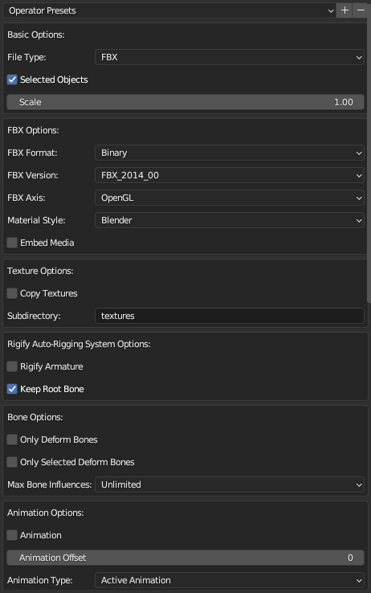
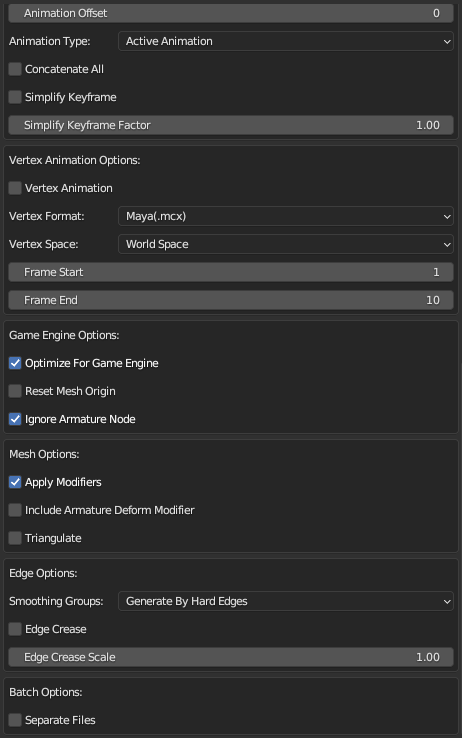
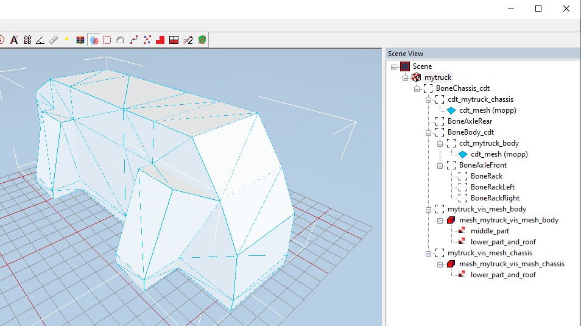

# Step 2: Exporting to FBX
To perform export to FBX we need to purchase and install the **Better Fbx Importer & Exporter** add-on for Blender.

It is available at <https://blendermarket.com/products/better-fbx-importer--exporter> with the installation instrustions and tutorials.

After installation and activation of this addon, we can perform clean export to FBX and avoid exporting Armature, which we do not need in the resulting FBX.

## Export Procedure
To perform export:

1.  Switch to the Object Mode.
2.  Select all contents of scene (assuming that it contains only our truck, its meshes, Armature with bones, and so on).
3.  In the main menu, select **File > Export > Better FBX Exporter (.fbx/.dae/.obj/.dxf)**.

    **NOTE**: If this menu item is dimmed, ensure that you have switched to the Object Mode and selected all contents. 

4.  In the appearing export dialog window, specify the name of the target FBX file and **correct export settings (see below)** and click **Better Export FBX**.

## Correct Export Settings
Correct export settings are shown in the list below, with non-default values highlighted.

**NOTE**: For our needs, the most suitable version of the **Better Fbx Importer & Exporter** add-on is `5.0.2` and the settings listed below are from this version. However, more recent versions of this add-on can also be used, but, in this case, you will need to set the **Reset Mesh Rotation** option to <mark>Enabled</mark> in *Game Engine Options* before exporting. Other settings, including **Reset Mesh Origin**, should remain as listed below. 

-   *Basic Options*:
    -   **File Type** – FBX
    -   **Selected Objects** – <mark>Enabled</mark>
    -   **Scale** – depending on the version of the add-on (recommended values):
        -   *For version `5.0.2`*:
            -   **Scale** – <mark>1.00</mark>
        -   *For version `5.4.6`*:
            -   **FBX Unit** *(New field)* – <mark>cm</mark>
            -   **Scale** – <mark>0.01</mark>            
-   *Fbx Options*:
    -   **FBX Format** – Binary
    -   **FBX Version** – <mark>FBX_2014_00</mark>
    -   **FBX Axis** – <mark>OpenGL</mark>
    -   **Material Style** – Blender
    -   **Embed Media** – Disabled
-   *Texture Options*:
    -   **Copy Textures** – Disabled
    -   **Subdirectory** – "textures"
-   *Rigify Auto-Rigging System Options*:
    -   **Rigify Armature** – Disabled
    -   **Keep Root Bone** – Enabled
-   *Bone Options*:
    -   **Only Deform Bones** – Disabled
    -   **Only Selected Deform Bones** – Disabled
    -   **Max Bone Influences** – Unlimited
-   *Animation Options*:
    -   **Animation** – <mark>Disabled</mark>
    -   *(you can leave all other options in this section with the default values)*
-   *Vertex Animation Options*:
    -   **Vertex Animation** – Disabled
    -   *(you can leave all other options in this section with the default values)*
-   *Game Engine Options*:
    -   **Optimize For Game Engine** – Enabled
    -   **Reset Mesh Origin** – <mark>Disabled</mark>
    -   *(For versions of addon higher than 5.0.2)* **Reset Mesh Rotation** – <mark>Enabled</mark>
    -   **Ignore Armature Node** – Enabled
-   *Mesh Options*:
    -   **Apply Modifiers** – Enabled
    -   **Include Armature Deform Modifier** – Disabled
    -   **Triangulate** – Disabled
-   *Edge Options*:
    -   **Smoothing Groups** – <mark>Generate By Hard Edges</mark>
    -   **Edge Crease** – <mark>Disabled</mark>
    -   **Edge Crease Scale** – 1.00
-   *Batch Options*:
    -   **Separate Files** – Disabled

I.e., the export options should look like the following:

  

**WARNING:** Screenshots above are from the **Better Fbx Importer & Exporter** add-on of the `5.0.2` version. For more recent versions, it is also necessary to set the **Reset Mesh Rotation** option to <mark>Enabled</mark> in *Game Engine Options* before exporting.

## Checking the FBX
After succesfull export, you can check the structure of the exported FBX and ensure that all is correct in the game Editor.

To do this:

1.  Put the resulting FBX file into the `meshes\trucks` subfolder of the [folder of the truck mod][mod_folder].
2.  Create the *fake* XML class of the mesh in the same folder and name it exactly as the FBX. E.g., if the name of your FBX is `mytruck.fbx`, the name of the XML file of the mesh must be `mytruck.xml`.
3.  Since it is a *fake* XML class of the mesh, you can specify only 1 tag in it, just to make this FBX findable in the Editor:
    
    ```xml
    <CombineXMesh/>
    ```

4.  In the [Editor], locate this XML file in the `meshes\trucks` folder in the **File View** panel and open it.
5.  The contents of the FBX will open in the Editor and you may ensure that all is correct.

For example, in our case, we will see something like this:



As you can see, the structure of the FBX is correct and materials (data on their names) are in place. Obviuosly, the materials are not rendered, since we have not configured texture files for them yet.

After checking that the FBX is correct, we can proceed to the next step – [the creation of textures](./step_3_creating_textures.md).


[mod_folder]: ./step_0_prerequisites.md#mod-folder
[editor]: ./../../../map_modding/getting_started/installation_and_first_launch.md