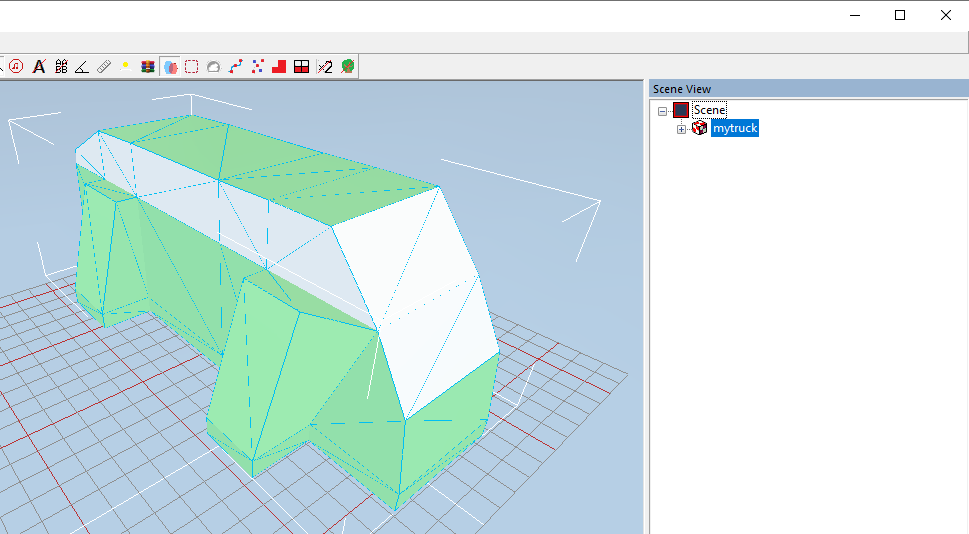

# Step 4: Creating XML File of Truck Mesh
Now, its time to map materials from the FBX to textures we have created. It is done in the XML file of the (Truck) Mesh.

It should be created in the [folder of the mod][truck_mod_folder], in the `meshes\trucks` subfolder there. The created XML file should be named exactly as the FBX that you put there before. E.g., `mytruck.xml` for the `mytruck.fbx`.

If you have created a _fake_ XML file of the mesh, it's time to fill it, if you have not created it yet, it's time to create it.

In this file, using [`<Material>`](./../../tags_and_attributes_of_trucks/combinexmesh/material/index.md) tags inside [`<CombineXMesh>`](./../../tags_and_attributes_of_trucks/combinexmesh/index.md), you can map materials from the FBX (in the `Name` attribute) to created textures (in the `AlbedoMap`, `NormalMap`, and other textural attributes). 

For example, in our simple case, this file will be similar to something like this:

```xml
<CombineXMesh>
	<Material
		AlbedoMap="trucks/middle_part_texture__d.tga"
		Name="middle_part"
	/>
	<Material
		AlbedoMap="trucks/lower_part_and_roof_texture__d.tga"
		Name="lower_part_and_roof"
	/>
</CombineXMesh>
```

**NOTE**: Along with this, for professional mods, XML file of the mesh contains a lot of other data. Particularly, it has links to other types of textures and multiple other parameters (`AlphaKill`, `MetalnessScale`, `Snowify...` attributes, etc.) in the [`<Material>`](./../../tags_and_attributes_of_trucks/combinexmesh/material/index.md) tags, [`<SocketPoints>`](./../../tags_and_attributes_of_trucks/combinexmesh/socketpoints/index.md) that set up attachment points for shafts, and [`<MaterialOverrides>`](./../../tags_and_attributes_of_trucks/combinexmesh/materialoverrides/index.md) for color customization. You can view all the necessary parameters in descriptions of these tags in the [**Tags and Attributes of Trucks**](./../../tags_and_attributes_of_trucks/index.md) section.

After you have edited this file and have saved your changes, you can reload the mesh of the truck in the Editor to ensure that all textures were applied correctly.



After that, we can proceed to the next step – [the creation of the XML file of the truck class](./step_5_creating_xml_file_of_truck_class.md).


[truck_mod_folder]: ./step_0_prerequisites.md#mod-folder