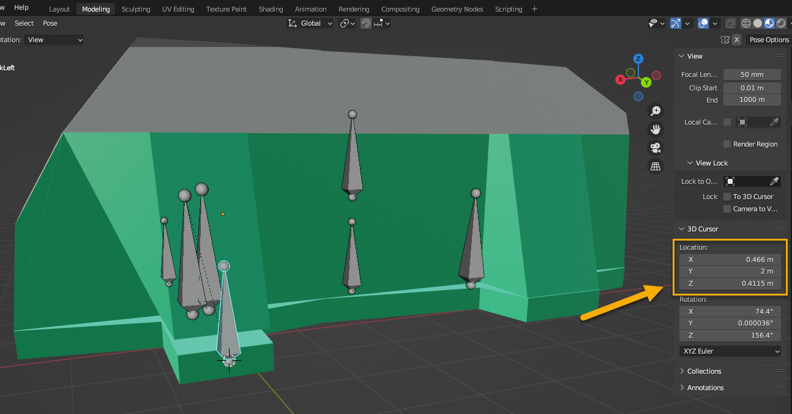
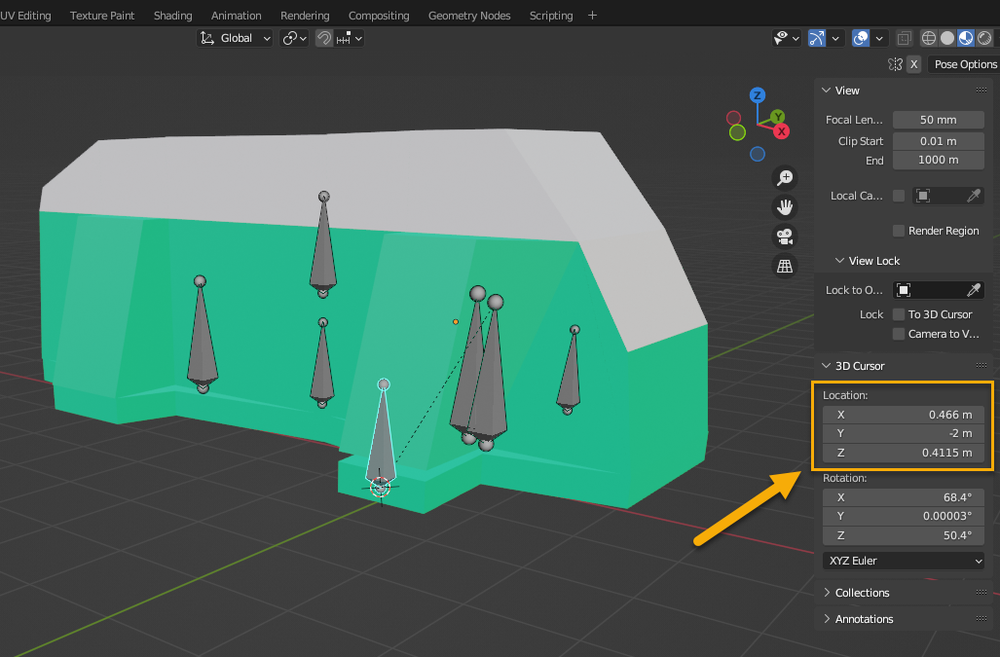
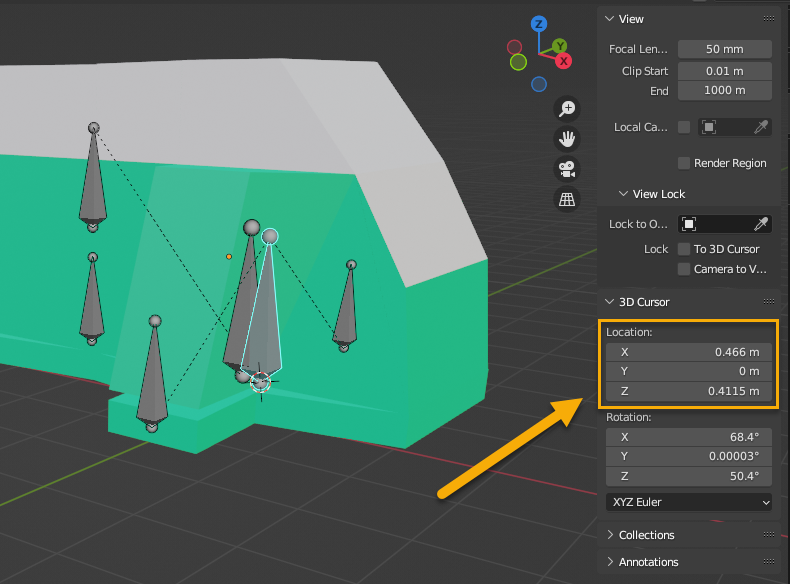
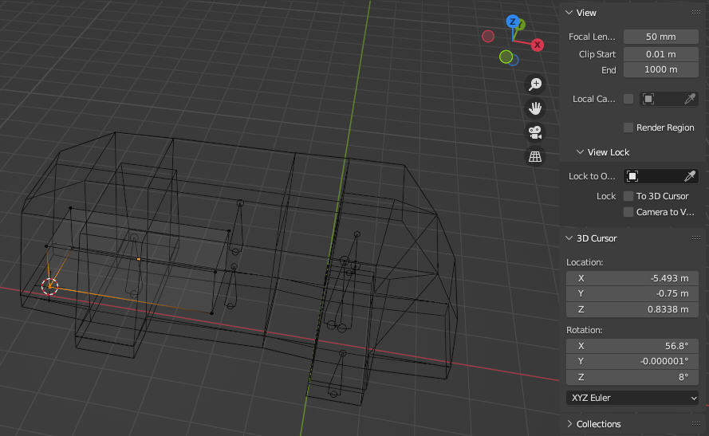
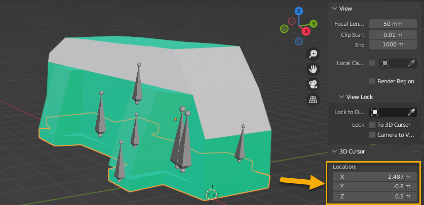
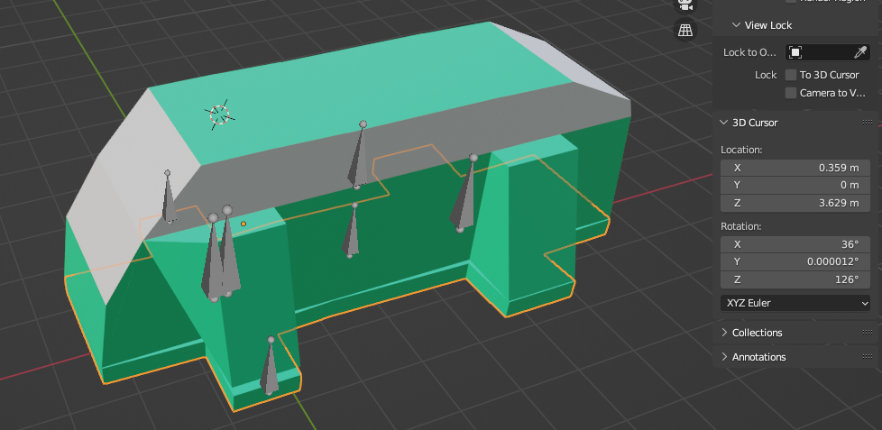

# Step 5: Creating XML File of Truck Class
Now it time to create and edit the cornerstone of the truck mod – an XML file of the (Truck) Class.

This file will contain all information on the behavior of the truck in the game engine.

It should be located in the `classes/trucks/` subfolder in the [folder of the mod][truck_mod_folder]. You should name the file similarly like you named the XML file of the mesh. E.g., in our sample it will be again `mytruck.xml`, but in the `classes/trucks/` subfolder.

The root tag of this file will be [`<Truck>`](./../../tags_and_attributes_of_trucks/truck/index.md) that will contain all other tags of the truck description.

```xml
<Truck>

	...

</Truck>
```

Below we will fill this file gradually, with only most required XML pieces, see subsections below.

**NOTE 1**: We will heavily use the predefined components that are provided with the game and are already described in its XML files. I.e., we will use predefined Wheels, Suspensions, Gearboxes, Engines to avoid creating custom entities of these types. However, for professional mods this can be done, if necessary.

**NOTE 2**: For professional mods, there is huge amount of other tags and attributes in the XML file of the class of the truck, see the [Truck](./../../tags_and_attributes_of_trucks/truck/index.md) section and _its subsections_ (corresponding to child-tags) in [**Tags and Attributes of Trucks**](./../../tags_and_attributes_of_trucks/index.md).

## TruckData
We will begin with adding a [`<TruckData>`](./../../tags_and_attributes_of_trucks/truck/truckdata/index.md) tag. 

```xml
<Truck>
	<TruckData>
		...
	</TruckData>
	...
</Truck>
```

Child-tags of `<TruckData>` describe the most properties of the truck itself (except properties related to physical model). The almost minimumal set of these child-tags is described in subsections below.

However, along with child tags, the [`<TruckData>`](./../../tags_and_attributes_of_trucks/truck/truckdata/index.md) tag also has attributes. Their full list (with descriptions) can be found in the **Tags and Attributes of Trucks** section. We will use only the most important of them:

```xml
<Truck>
	<TruckData
    	DiffLockType="Always"
		EngineIconMesh="env/engine_small"
		FuelCapacity="250"
		Responsiveness="0.4"
		SteerSpeed="0.04"
		BackSteerSpeed="0.04"
		TruckImage="interloadstarmchr"
		TruckType="SCOUT"
    >
		...
	</TruckData>
	...
</Truck>
```
As you can see, we have used a predefined mesh for the visualization of the semitransparent engine (`"env/engine_small"`).

And, we have used a placeholder for `TruckImage`, since creating images for the truck is *not* covered by this guide. 

**TIP**: Info on images is available in descriptions of attributes of the [`<TruckData>`](./../../tags_and_attributes_of_trucks/truck/truckdata/index.md) and [`<UiDesc>`](./../../tags_and_attributes_of_trucks/truck/gamedata/uidesc/index.md) tags, so you can create them too if you want.

Now, its time to add child-tags.

### Wheels and CompatibleWheels
First of all, we will add information on the wheels. It is added by two types of tags:

-   The [`<Wheels>`](./../../tags_and_attributes_of_trucks/truck/truckdata/wheels/index.md) tag, where position and other properties of every wheel are described within a separate [`<Wheel>`](./../../tags_and_attributes_of_trucks/truck/truckdata/wheels/wheel/index.md) child-tag.
-   The single or multiple [`<CompatibleWheels>`](./../../tags_and_attributes_of_trucks/truck/truckdata/compatiblewheels/index.md) tags, where (types of) wheels compatible with the truck are listed. 

Within the [`<Wheels>`](./../../tags_and_attributes_of_trucks/truck/truckdata/wheels/index.md) tag we will also specify the defalt tires (`DefaultTire`) and rims (`DefaultRim`) that will be used for our wheels. And, importantly, the name of the default XML class of the wheels (`DefaultWheelType`) where the system will look for these default tires and rims should be described. In our sample, we will use the predefined values (and XML class of the wheels) from the game:

```xml
		<Wheels
			DefaultRim="rim_2"
			DefaultTire="offroad_2"
			DefaultWheelType="wheels_scout2"
		>
        	...
        </Wheels>
```

**NOTE**: If necessary, you can create your own XML class of the wheels or select another predefined values. Predefined XML classes of the wheels can be found in the `initial.pak` archive, within the `[media]\classes\wheels` folder there. 

To correctly specify the position (the `Pos` attribute) of every wheel (in the [`<Wheel>`](./../../tags_and_attributes_of_trucks/truck/truckdata/wheels/wheel/index.md) child-tag), typically, we will need to refer to our Blender scene and identify the position where we want to place this wheel. 

This can be done using the Blender's [3D Cursor](https://docs.blender.org/manual/en/latest/editors/3dview/3d_cursor.html) tool and the snapping mechanics (SHIFT + S), similarly as you did with the bones (see above). For example, to identify the position of `BoneRackLeft`, you can select this bone, press SHIFT + S, select **Cursor to Selected**, and then view the coordinates in the **View > 3D Cusrsor** panel:  



Then, you can specify these coordinates (with some offset, if necessary) in the `Pos` attribute of the [`<Wheel>`](./../../tags_and_attributes_of_trucks/truck/truckdata/wheels/wheel/index.md).

However, before you do that, please read the:

**Important note on coordinates**: When you will be speicifing coordinates for positions of various components in XML files of your mod, you should take into account the differnce between [coordinate axes](./../../general_info/fbx_file_structure/coordinate_axes.md) of the game and your 3D Editor. Particularly, for Blender, the Z coordinate should be specified instead of Y and Y instead of Z. For example, if the coordinates in Blender are `(0.466; 2; 0.4115)`, in the XML files you need to refer to them as to `(0.466; 0.4115; 2)`.

So, for the front left wheel we will have the description similar to the following:

```xml
		<Wheels
			DefaultRim="rim_2"
			DefaultTire="offroad_2"
			DefaultWheelType="wheels_scout2"
		>
			<Wheel
                Pos="(0.466; 0.4115; 2)"
            	Location="front"
			    SteeringAngle="30"
			    SteeringCastor="3"
			    SteeringJointOffset="0.12"
			    Torque="full"
			    ParentFrame="BoneBody_cdt"
            />

            ...

        </Wheels>
```
**NOTE**: Descriptions of other attributes of the [`<Wheel>`](./../../tags_and_attributes_of_trucks/truck/truckdata/wheels/wheel/index.md) tag can be seen in **Tags and Attributes of Trucks** section.

Moreover, there is also another important aspect:

**Important note on Z coordinates of right wheels**: The `Pos` attribute of the `<Wheel>` tag sets the postion of the *left* wheel. However, by setting the `RightSide` attribute to `true`, we are marking this wheel as a right one and the system takes the Z coordinate from `Pos` and makes it negative. So, initially, we should specify a positive value for it, regardless of the fact that in Blender it is negative. And, of course, we should take the previous important note into account.

So, for example, in Blender, the position of the right wheel will be `(0.466; -2; 0.4115)`:



And, in XML file, the position of the right wheel will be the same as for the left one – `(0.466; 0.4115; 2)`, but with the `RightSide="true"`: 

```xml
		<Wheels
			DefaultRim="rim_2"
			DefaultTire="offroad_2"
			DefaultWheelType="wheels_scout2"
		>
			<Wheel
                ...
            />
			
			<Wheel 
                Pos="(0.466; 0.4115; 2)"
            	Location="front"
			    SteeringAngle="30"
			    SteeringCastor="3"
			    SteeringJointOffset="0.12"
			    Torque="full"
			    ParentFrame="BoneBody_cdt"
                RightSide="true"
            />

            ...

        </Wheels>
```

Rear wheels are specified similarly:
```xml
		<Wheels
			...
		>
            ...
			<Wheel 
                Pos="(-3.926; 0.4115; 2)"
            	ConnectedToHandbrake="true"
			    Location="rear"
			    Torque="default"
            />
			<Wheel
                Pos="(-3.926; 0.4115; 2)"
            	ConnectedToHandbrake="true"
			    Location="rear"
			    Torque="default"
                RightSide="true"
            />
		</Wheels>
```
**NOTE**: Descriptions of other attributes of the [`<Wheel>`](./../../tags_and_attributes_of_trucks/truck/truckdata/wheels/wheel/index.md) tag can be seen in the **Tags and Attributes of Trucks** section.

To finish with the wheels, let's add some [`<CompatibleWheels>`](./../../tags_and_attributes_of_trucks/truck/truckdata/compatiblewheels/index.md) tags to specify types of wheels compatible with the truck:

```xml
<Truck>
	<TruckData
    	...
    >
		<Wheels
			...
		>
            ...
		</Wheels>

		<CompatibleWheels Scale="0.57" Type="wheels_scout1" />
		<CompatibleWheels Scale="0.65" Type="wheels_scout2" />
	</TruckData>
</Truck>
```
This will add references to two predefined XML classes of compatible wheels: `wheels_scout1` and `wheels_scout2` (with different sizes of them).

### SuspensionSocket, EngineSocket, GearboxSocket, and WinchUpgradeSocket

Now it's time to describe such components of the truck as the Suspension, Engine, Gerabox, and Winch. 

Each (set) of them needs to be described in a separate XML file – within `classes\suspensions`, `classes\engines`, `classes\gearboxes` and `classes\winches` subfolders. Every such file will list all variants of these components that are *compatible* with our truck mod.

And, the XML class of the Truck will be simply _referencing_ these files and, for every such component, will be setting the *default variant* from the set.

In this tutorial, we will use the copies of XML classes created for *International Loadstar 1700* and will reference them in our XML class of the truck. 

All tags for referencing these components from the XML class of the truck – [`<SuspensionSocket>`](./../../tags_and_attributes_of_trucks/truck/truckdata/suspensionsocket/index.md), [`<EngineSocket>`](./../../tags_and_attributes_of_trucks/truck/truckdata/enginesocket/index.md), [`<GearboxSocket>`](./../../tags_and_attributes_of_trucks/truck/truckdata/gearboxsocket/index.md), and [`<WinchUpgradeSocket>`](./../../tags_and_attributes_of_trucks/truck/truckdata/winchupgradesocket/index.md) – have the same main structure:

-   In the `Type` attribute, they link to the XML file of the class of the component from the `.../classes/<component>` folder.
-   In the `Default` attribute, they reference a certain particular description of a component from this file (with the same `Name` in this file) as a default one. 

Particularly, if we were referencing the *original* XML classes of these components of *International Loadstar 1700*, these descriptions could look like the following:

```xml
        <SuspensionSocket
			Default="international_loadstar_1700_suspension_default"
			Type="s_international_loadstar_1700"
			MaxWheelRadiusWithoutSuspension="0.5"
		/>

		<EngineSocket
        	Default="us_truck_loadstar_1700_engine_0"
        	Type="e_us_truck_old_international_loadstar_1700"
        />

		<GearboxSocket
        	Default="g_truck_loadstar_1700_default"
        	Type="gearboxes_trucks_international_loadstar_1700"
        />

        <WinchUpgradeSocket
        	Default="w_scout_pow"
            IsUpgradable="true"
            Type="winches_scouts"
        />
```
However, there is an important nuance – if we create it this way, our mod will be not [packable][packable]. With references to mentioned *original* XML classes, you will be able to [spawn][spawn] the mod on the [Proving Grounds][proving_grounds] map, but you will not be able to [pack][packable] it.

To create a [packable][packable] mod, you will need to create the *slightly modified* copies of these XML classes and reference them instead of the original files.

We will do it in the [next step][step_6], now you can simply add the XML piece above within the [`<TruckData>`](./../../tags_and_attributes_of_trucks/truck/truckdata/index.md) tag, remembering that this data is not final and will be modified.


### Axles and SteeringRack 

At this stage, we can set up axles ([`<Axles>`](./../../tags_and_attributes_of_trucks/truck/truckdata/axles/index.md)) and steering rack ([`<SteeringRack>`](./../../tags_and_attributes_of_trucks/truck/truckdata/steeringrack/index.md)). 

In the bone hierarchy of the truck, we have set up two bones for axles: `BoneAxleFront` and `BoneAxleRear`.

Now, we can link the axles that will be automatically created by the game (between two nearest opposite wheels) to these bones:

```xml
		<Axles>
			<Axle Frame="BoneAxleFront" />
			<Axle Frame="BoneAxleRear" />
		</Axles>
```
However, there is also an important nuance here. The specified bones of the axles should have the same X and Y (Z in Blender) coordinates as were specified for the corresponding pair of the Wheels.

Particularly, for front left and wheels we had `Pos="(0.466; 0.4115; 2)"` (see above) and the position of the `BoneAxleFront` bone is also `(0.466; 0; 0.4115)`, taking into account that Z in Blender is specified as Y in the game. 



**NOTE**: More details on setup of an [`<Axle>`](./../../tags_and_attributes_of_trucks/truck/truckdata/axles/axle/index.md) can be found in **Tags and Attributes of Trucks**.

Now, we can setup the steering rack. Similarly to axles, we had set up 3 bones for it: `BoneRack` for the rack itself, `BoneRackLeft` for the left wheel hub, and `BoneRackRight` for the right wheel hub. We had placed these bones in the following way:

-   The `BoneRackLeft` and `BoneRackRight` bones were placed in one line with the front axle – with the same X and Y (Z in Blender) coordinates as those of the `BoneAxleFront` bone.
-   The `BoneRack` was placed near the line of the axle, a little bit to the side of it, where the geometry of the steering rack would be located (if it was modelled).

**NOTE**: For details, see [SteeringRack](./../../tags_and_attributes_of_trucks/truck/truckdata/steeringrack/index.md) in **Tags and Attributes of Trucks**.

So, now we can simply list these bones as values of attributes of the `<SteeringRack>` tag. 

Along with this, we must specify the `RackHalfSizeZ` attribute there that will allow the system to identify the half of the length of the steering rack, which is necessary for the correct simulation. We have placed `BoneRackLeft` and `BoneRackRight` bones at the same distance from the `BoneAxleFront`, particularly – both of them are in `2` meters from it in Blender, so the full distance between them is `4` and the half of this distance (`RackHalfSizeZ`) is `2`.    

So, our `<SteeringRack>` piece should look like the following:

```xml

		<SteeringRack
			Frame="BoneRack"
			FrameSteerLeft="BoneRackLeft"
			FrameSteerRight="BoneRackRight"
			RackHalfSizeZ="2"
		/>
```

###  FuelTank and Damage
We have already set up the _volume_ of the fuel tank of our truck (in the `FuelCapacity` attribute of `<TruckData>`, see above).

Now, we can set up its _damage capacity_, i.e. the amount of maximum damage the fuel tank can take:

```xml
		<FuelTank DamageCapacity="150" />
```

And, we can set up the area on the model where this fuel tank will be conventionally located, which is necessary for damage calculations. I.e., we will specify _what part of the model_ will be responsible for the damage to a fuel tank. 

This part of the model is set up as a cube, whose position and size are identified by two vectors: one looking at the lower right back vertex of this cube (the `Min` attribute of the `<DamageArea>` tag) and another one looking at the upper left front vertex of this cube (the `Max` attribute). 

We can create an auxiliary temporary cube in Blender to visualize the fuel tank and identify the positions of these vertices (then you will need to delete it). The picture below shows position for the `Min` attribute on a sample cube. The coordinates for the `Max` attribute are identified in a similar way (but remember that Z in Blender is Y in XML).



Thus, the `<DamageArea>` for the fuel tank in our sample will look similarly to the followng (it should be wrapped by the `<Damage>` parent tag that groups all damage areas):

```xml
		<Damage>
			<DamageArea
                Type="FuelTank"
                Min="(-5.493; 0.8338; -0.75)"
                Max="(-2.093; 1.834; 0.75)"
                ParentFrame="BoneChassis_cdt"
            />
		</Damage>	
```

**NOTE**: For details, see [DamageArea](./../../tags_and_attributes_of_trucks/truck/truckdata/damage/damagearea/index.md) in **Tags and Attributes of Trucks**.

The same approach can be used to set up the size and position of the damage area for the Engine. In our case, we will set up it like this:

```xml
		<Damage>
            ...
			<DamageArea
                Type="Engine"
                Min="(0.7717; 0.826; -0.5)"
                Max="(2.172; 1.826; 0.5)"
                ParentFrame="BoneChassis_cdt"
            />
		</Damage>
```

### Inventory and DeployCost

Since our truck mod is targeted at Expeditions, it is a good idea to add some Inventory Slots to it.

This can be done by specifying their maximum number in the `MaxLimit` attribute of the [`<Inventory>`](./../../tags_and_attributes_of_trucks/truck/truckdata/inventory/index.md) tag within [`<TruckData>`](./../../tags_and_attributes_of_trucks/truck/truckdata/index.md). We have a middle-sized van with a lots of space, so let's make `7` slots in it:  

```xml
		<Inventory MaxLimit="7"/>
```

**NOTE**: Along with these Inventory Slots, we can also create various Addons and Consumables to add them to your mod. This process of out of the scope of this guide, but you can start with [Addon Changes](./../../new_features/addon_changes.md) article in the **New Features** section if you want to do this.

And, let's also specify the cost of deploying our truck to the base during an Expedition. This can be done using the [`<DeployCost>`](./../../tags_and_attributes_of_trucks/truck/truckdata/deploycost/index.md) tag. `100` credits will do as the `Cost` value:

```xml
		<DeployCost Cost = "100"/>
```

**NOTE**: The [`<DeployCost>`](./../../tags_and_attributes_of_trucks/truck/truckdata/deploycost/index.md) feature is currently in the development and is not actually used yet. Regardless of this fact, the XML classes of trucks for Expeditions typically have this configuration. Already used new features that are specific to Expeditions are observed in the **New Features** section of **Truck Modding**.

At this stage, we have finished with child-tags of the `<TruckData>` (don't forget to close the `<TruckData>` tag).


## PhysicsModel
Now, we can proceed to the description of the physical model of the truck. It is described within the [`<PhysicsModel>`](./../../tags_and_attributes_of_trucks/truck/physicsmodel/index.md) section of `<Truck>`, by child-tags of `<PhysicsModel>`.

However, the [`<PhysicsModel>`](./../../tags_and_attributes_of_trucks/truck/physicsmodel/index.md) tag itself has an attribute, and an important one. It is the `Mesh` attribute that specifies the path to the FBX file of the truck and its name, without the file extension, relative to the `meshes` folder.

Previously, we have named our FBX as `mytruck.fbx` and put it to `meshes/trucks/` folder (along with the XML file of the mesh, see above). So, in our case, the `<PhysicsModel>` section will look like the following:  

```xml
<Truck>
	...
	<PhysicsModel Mesh="trucks/mytruck">
		...
	</PhysicsModel>
	...
</Truck>
```
Inside this section, using the child-tags of `<PhysicsModel>` ([`<Body>`](./../../tags_and_attributes_of_trucks/truck/physicsmodel/body/index.md), [`<Constraint>`](./../../tags_and_attributes_of_trucks/truck/physicsmodel/body/constraint/index.md), etc.), we will describe the properties of physical bones of our truck and relations between them. I.e., we need to describe here the bones that must react to gravity, collide with each other, have friction, and so on.

**NOTE**: All bones of the physical model must have collision objects attached to them in the FBX file of the model. For these bones, we had used the `NameOfBone_cdt` naming pattern, which highlights that this bone has a collision mesh.

### NetSync
However, before describing physical bones themselves, let's touch a topic of synchronization of trucks in COOP, since a good mod should work there too.

By default, during COOP, the system synchronizes the positions and speeds of _all_ physical bones between players. However, the amount of these bones in the professional mods can be rather large, so it is better to disable this behavior and synchronize only the particular bones. 

This can be done by setting the `Legacy` attribute of the [`<NetSync>`](./../../tags_and_attributes_of_trucks/truck/physicsmodel/netsync/index.md) tag to `false`:

```xml
		<NetSync Legacy="false" />
```

After that, only the bones ([`<Body>`](./../../tags_and_attributes_of_trucks/truck/physicsmodel/body/index.md)) with the `"pv"` value of the `NetSync` attribute of the `<Body>` tag (`NetSync="pv"`) will be synchronized.

In our example, we have only 2 physical bones, so for us this pipeline is not critical at all. However, this pipeline may be a required one if you are creating a professional truck mod.

### Body tags and Constraints
In general, the physical model of the truck defines:

-   The set of physical bodies of the truck (physical bones + attached collision meshes).  
    Every physical body is described as a [`<Body>`](./../../tags_and_attributes_of_trucks/truck/physicsmodel/body/index.md) tag.

-   The hierarchy of this physical bodies that will affect the relations between them.  
    I.e., these `<Body>` tags can be nested within each other to form a hierarchy.

-   The way these `<Body>` tags are bound together by the constraints between them.  
    I.e., every pair of physical bodies can be bound together by the [`<Constraint>`](./../../tags_and_attributes_of_trucks/truck/physicsmodel/body/constraint/index.md) tag, placed in the nested physical body.  

Thus, the [`<PhysicsModel>`](./../../tags_and_attributes_of_trucks/truck/physicsmodel/index.md) section consists mainly of: 
[`<Body>`](./../../tags_and_attributes_of_trucks/truck/physicsmodel/body/index.md) tags, their nesting hierarchy, and their [`<Constraint>`](./../../tags_and_attributes_of_trucks/truck/physicsmodel/body/constraint/index.md) tags.

**NOTE**: All physical bodies must have collision meshes attached to them. The hierarchy of physical bones in the FBX file must be the same as the hierarchy of the physical bodies in the description of the physics model. This hierarchy must have only one root physical body.

In our sample, we have only 2 physical bones: `BoneChassis_cdt` and `BoneBody_cdt`. All other bones of our model are not physical, i.e. they do not have collision meshes. Thus, our physical model will consist of these two physical bones (bodies) only. 

So, in our physical model, the `BoneChassis_cdt` body will be the root physical body that will have the `BoneBody_cdt` body as a child, which will match their hierarchy in the FBX file. And, the `BoneBody_cdt` body will be attached to its parent (the `BoneChassis_cdt` body) by the `<Constraint>` of the `Fixed` type, telling the system that the connection between these two bodies is fixed.

I.e., in pseudo-code our physical model will look like this:

```text
        "BoneChassis_cdt" physical body (parent)
            "BoneBody_cdt" physical body (child)
                "Fixed" contraint that binds (child) to (parent)
```
But, since these are physical bodies, they must have a least their masses specified (in the `Mass` attribute). We will specify `1750` as the mass of the chassis and `1550` as the mass of the body, to make our truck a little bit more stable.

Along with that, we would also like to shift the position of the center of the mass for the `BoneBody_cdt` physical body a little bit lower and a little bit closer to the front than the default value that is calculated automatically, since our engine is also located at the front and, again, for stability. We will do that by specifying the `CenterOfMassOffset` for this physical body and will specify there `(-0.5; -0.25; 0.0)` (remember, Z in Blender is Y in XML) as an offset vector relative to the automatically calculated center of mass of the `BoneBody_cdt` physical body.

Finally, we will add some special effects related to truck physical bodies by setting `ImpactType` attribute to `Truck` and add synchorization of our both physical bones via `NetSync` attribute that we discussed earlier.

The result will look like the following:

```xml
	<PhysicsModel Mesh="trucks/mytruck">
		<NetSync Legacy="false" />
		<Body
			ModelFrame="BoneChassis_cdt"
			ImpactType="Truck"
			Mass="1750"
			NetSync="pv"
		>
			<Body
				ModelFrame="BoneBody_cdt"
                CenterOfMassOffset="(-0.5; -0.25; 0.0)"
				ImpactType="Truck"
				Mass="1550"
				NetSync="pv"
			>
				<Constraint Type="Fixed" />
			</Body>
		</Body>
	</PhysicsModel>
```

**NOTE 1**: For details, see [PhysicsModel](./../../tags_and_attributes_of_trucks/truck/physicsmodel/index.md), [Body](./../../tags_and_attributes_of_trucks/truck/physicsmodel/body/index.md), [Constraint](./../../tags_and_attributes_of_trucks/truck/physicsmodel/body/constraint/index.md) in **Tags and Attributes of Trucks**. 

**NOTE 2**: In the original XML classes of trucks – that can be found in the `initial.pak` archive, within the `[media]\classes\trucks` folder there – the `ModelFrame` attribute for the root physical bone is typically omitted. We have added it here for clarity, but you can omit it too since the system identifies the root physical bone automatically anyway.

That's it, we have created the physical model of our simple truck. Now, we can proceed to `<GameData>`.  

## GameData

Within the [`<GameData>`](./../../tags_and_attributes_of_trucks/truck/gamedata/index.md) section, you need to specify truck details that are related to its interaction with the environment, such as: its price, camera presets for the **Customize** menu in the Garage, winch sockets, its name, description and images for the UI of the game, sockets for the addons available fot the truck, etc.

The [`<GameData>`](./../../tags_and_attributes_of_trucks/truck/gamedata/index.md) tag itself also has attributes, so let's start with them.

We will specify price of our truck (`Price="5700"`), whether or not it can return back from the Expedition (`Recallable="true"`), and whether or not it should be locked in the **Truck Store** until the player finds it within the map (`UnlockByExploration="false"`).

So, our `<GameData>` piece initially will look like the following:

```xml
	<GameData
		Price="5700"
		Recallable="true"
		UnlockByExploration="false"
	>
		...
	</GameData>
```
Now, its time to specify other properties as child-tags.

### CustomizationCameras
We have not created Addons or Consumables for our truck. But, anyway, it might be a good idea to add a full set of camera presets for the **Customize** menu in the Garage. If you decide to create some addons for your truck mod later on, these presets will be helpful and you can customize them as needed.

However, for simplicity, we will not focus on setting up the exact values in these presets and will simply copy them from the XML class of the one of the trucks that is stored within the `initial.pak` archive (within the `[media]\classes\trucks` folder there). 

The `initial.pak` archive itself is located in the *folder of the installed game*, within the `\preload\paks\client\` subfolder there, and you will probably need WinRAR extractor tool to browse this archive. Dear `initial.pak`, don't move! This is a robbery! :)

So, here they are:

```xml
		<CustomizationCameras>
			<CameraPos FOV="32.0" Name="default" InterestPosition="(6.83; 1.1; 0.35)"  MaxXRotation="0" MaxYRotation="0" MaxZoom="0" Position="(13.8; 1.83; -2.5)" />
			<CameraPos FOV="32.0" Name="side_l" InterestPosition="(6.23; 1.35; 0)"  MaxXRotation="0" MaxYRotation="0" MaxZoom="0" Position="(10.9; 2.35; -7.1)" />
			<CameraPos FOV="32.0" Name="side_r" InterestPosition="(4.75; 1.25; 0)"  MaxXRotation="0" MaxYRotation="0" MaxZoom="0" Position="(10.1; 2.35; 8.1)" />
			<CameraPos FOV="32.0" Name="roof" InterestPosition="(4.98; 1.83; 0.15)"  MaxXRotation="0" MaxYRotation="0" MaxZoom="0" Position="(8.7; 5.75; -1.35)" />
			<CameraPos FOV="32.0" Name="wheels" Position="(12.2; 0.5; -4.2)" InterestPosition="(5.2; 0.5; 0.45)"  MaxXRotation="0" MaxYRotation="0" MaxZoom="0" />
			<CameraPos FOV="32.0" Name="rear" InterestPosition="(5.5; 0.85; 0)"  MaxXRotation="0" MaxYRotation="0" MaxZoom="0" Position="(-1.5; 7.5; -8.0)" />
			<CameraPos FOV="32.0" Name="addon_1" InterestPosition="(5.8; 1.2; 0)" MaxXRotation="0" MaxYRotation="0" MaxZoom="0" Position="(-3.85; 4.3; -7.2)" />
			
			<CameraPos FOV="32.0" Name="side_l_sticker" Position="(4.9; 1.16; -3.093)" InterestPosition="(5.561; 1.173; -0.0)" MaxXRotation="0" MaxYRotation="0" MaxZoom="0"/>
			<CameraPos FOV="32.0" Name="side_r_sticker" Position="(4.9; 1.16; 3.093)" InterestPosition="(6.889; 1.173; -0.0)" MaxXRotation="0" MaxYRotation="0" MaxZoom="0"/>
			<CameraPos FOV="32.0" Name="capote_sticker" Position="(9.5; 4.9; -0.8)" InterestPosition="(6.659; 1.533; -0.3)" MaxXRotation="0" MaxYRotation="0" MaxZoom="0"/>			
			<CameraPos FOV="32.0" Name="roof_sticker" Position="(7.157; 6.061; -0.4)" InterestPosition="(5.162; 1.83; -0.4)" MaxXRotation="0" MaxYRotation="0" MaxZoom="0"/>
		</CustomizationCameras>
```

**NOTE**: For details on attributes used here, see [CameraPos](./../../tags_and_attributes_of_trucks/truck/gamedata/customizationcameras/camerapos/index.md) in **Tags and Attributes of Trucks**.

### WinchSocket tags
The `<GameData>` section allows us to set up a set of winch mounting locations that can be used by the player. This is done by the [`<WinchSocket>`](./../../tags_and_attributes_of_trucks/truck/gamedata/winchsocket/index.md) tags. 

Every such tag corresponds to a single mounting location, with its coordinates specified in the `Pos` attribute of this tag. These coordintates can be identified in Blender scene, in a standard way (as we did it before).

In our sample, we will add 4 winch mounting points: 2 on the front and 2 on the rear part of our truck. We will position these points symmetrically, on the mesh of the chassis.

For example, the front right winch mounting point will be located as shown on the picture below.



The resulting set of `<WinchSocket>` tags will look similarly to the following:

```xml
		<WinchSocket Pos="(2.487; 0.5; -0.8)" />
		<WinchSocket Pos="(2.487; 0.5; 0.8)" />
		<WinchSocket Pos="(-6.052; 0.5; -0.8)" />
		<WinchSocket Pos="(-6.052; 0.5; 0.8)" />
```
That's it for `<WinchSocket>` tags. After adding our mod to the game, we will be able to test them.

### UiDesc
The [`<UiDesc>`](./../../tags_and_attributes_of_trucks/truck/gamedata/uidesc/index.md) tag allows you to specify properties of your truck for the UI of the game.

Particularly, it allows you to set the name of your truck (in the `UiName` attribute), its description (`UiDesc`) and various icons and imaginary to be used in the UI (`UiIcon30x30`, `UiIcon40x40`, `UiIcon576x640`).

The name of the truck (`UiName`) and its textual description can be localized to different languages. That's why, in the XML classes of the original trucks you can see the UI placeholders that are the identifiers of the localization strings, e.g. `UI_VEHICLE_INTERNATIONAL_LOADSTAR_1700_DESC` as a value of `UiDesc`. If necessary, you can localize these fields too, however this is out of the scope of the current guide.

But, these fields also support regular text values, so if the localization is not needed, you can simply specify the name of your truck and its description as text values in the appropriate XML attributes.

For example:

```xml
		<UiDesc
			UiDesc="Green Possum Van has enough space for people, animals, inventory, and a book by Gerald Durrell."
			UiName="Green Possum Van"
		/>
```

However, that's not all. You can also specify a small icon of _the type_ of your truck (`UiIcon30x30`) and the large icon of its type (`UiIcon40x40`). In these fields, you can select from the predefined icons of truck types, see the description of the [`<UiDesc>`](./../../tags_and_attributes_of_trucks/truck/gamedata/uidesc/index.md) tag in **Tags and Attributes of Trucks**. Particularly, we will select `scoutVehicleImg30` and `scoutVehicleImg` icons for these fields since we consider that our truck is a scout.

```xml
		<UiDesc
			...
			UiIcon30x30="scoutVehicleImg30"
			UiIcon40x40="scoutVehicleImg"
		/>
```
Finally, the `UiIcon576x640` attribute of the `<UiDesc>` tag allows us to specify the large image of our truck in the **Truck Store**. 

In general, the file of this image should be in the `.png` format, should have `576 x 640` dimensions, and should be located in the folder of the mod, within the `/ui/textures/` subfolder. 

And, you can also create a black-and-white image that will be used if the truck will be locked.

However, we will not create these images there. Instead, we will use the `"shopImgLoadStarExp"`placeholder for the `UiIcon576x640` attribute. The result, currently, will be *not* pretty, but our goal is to quickly create a simple mod that can be polished later.

**TIP**: Info on images is available in descriptions of attributes of the [`<TruckData>`](./../../tags_and_attributes_of_trucks/truck/truckdata/index.md) and [`<UiDesc>`](./../../tags_and_attributes_of_trucks/truck/gamedata/uidesc/index.md) tags, so you can create them too if you want.
   
So, our `<UiDesc>` tag will look like the following:

```xml
		<UiDesc
			UiDesc="Green Possum Van has enough space for people, animals, inventory, and a book by Gerald Durrell."
			UiIcon30x30="scoutVehicleImg30"
			UiIcon40x40="scoutVehicleImg"
			UiIcon576x640="shopImgLoadStarExp"
			UiName="Green Possum Van"
		/>
```

**NOTE**: If you were creating a SnowRunner mod (not the Expeditions one), you would be specifying the image for the **Truck Store** in the different attribute – `UiIcon328x458`. Along with that, you would be able to specify a logo in the `UiIconLogo` attribute. For details, see the description of the [`<UiDesc>`](./../../tags_and_attributes_of_trucks/truck/gamedata/uidesc/index.md) tag in **Tags and Attributes of Trucks**.

### AddonSockets
Another important thing that the [`<GameData>`](./../../tags_and_attributes_of_trucks/truck/gamedata/index.md) section allows us to specify is sockets for Addons ([`<AddonSockets>`](./../../tags_and_attributes_of_trucks/truck/gamedata/addonsockets/index.md)) that are necessary for their installation on the truck. 

Currently, no Addons can be installed to our van, since, first of all, we have not created them and since we have not created [`<AddonSockets>`](./../../tags_and_attributes_of_trucks/truck/gamedata/addonsockets/index.md) for them. That's why, the corresponding sections in the **Customize** menu of the Garage will be almost empty for us, if we open the game with our truck mod now.

The creation of addons is a separate topic and is out of the scope of this article. If you want to create an addon, you can begin with [Addon Changes](./../../new_features/addon_changes.md) article in **New Features** and [addon tags](./../../tags_and_attributes_of_trucks/truckaddon/index.md) in **Tags and Attributes of Trucks**, browsing the XML classes of the addons in the `initial.pak`, and experimenting.

However, there is one already created addon that is not very much truck-specific and we can adapt it to work with our truck. We are speaking about the **Metal Detector**.

On all trucks, this addon is installed to the addon socket ([`<Socket>`](./../../tags_and_attributes_of_trucks/truck/gamedata/addonsockets/socket/index.md)) with `Names="ScoutMetalDetector"`. The `Names` attribute here sets the addon types that can be istalled to this socket. The values within this field must be equal to the addon type(s) specified in the corresponding XML class(es) of the addon(s), in the `Type` attribute of [`<InstallSocket>`](./../../tags_and_attributes_of_trucks/truckaddon/gamedata/installsocket/index.md) there. So, if we add such addon socket to our `<GameData>` section, we will be able to install to our truck. 

But, that's not all. To install it correcty, we need to know the `Offset` – the position of the attachment point of this addon (in the coordinates of the truck, considering the origin in the FBX file as zero coordinates). We can identify this position in Blender, as we did before.



And, this addon has a piece that is installed within the interior of the cabin, and we have not created the cabin at all. So, we will just hide this element, but specifying offset for its attachment bones in the way that puts it within the mesh of our truck (see two [`<ExtraParent>`](./../../tags_and_attributes_of_trucks/truck/gamedata/addonsockets/socket/extraparent/index.md) tags below). Yep, that's bad, please forgive us (or, create a cabin and install this element correctly :).

The resulting code will look similarly to the following:

```xml
		<AddonSockets >
			<Socket Names="ScoutMetalDetector" Offset="(0.359; 3.629; 0)" ParentFrame="BoneBody_cdt">
					<ExtraParent Offset="(-1; -1; 0)" Frame="BoneBody_cdt"/>
					<ExtraParent Offset="(-1; -1; 0)" Frame="BoneBody_cdt" />
			</Socket>
		</AddonSockets>
```

**NOTE**: For details, see [Addon Changes](./../../new_features/addon_changes.md) in **New Features** section and [AddonSockets](./../../tags_and_attributes_of_trucks/truck/gamedata/addonsockets/index.md), [Socket](./../../tags_and_attributes_of_trucks/truck/gamedata/addonsockets/socket/index.md), and [ExtraParent](./../../tags_and_attributes_of_trucks/truck/gamedata/addonsockets/socket/extraparent/index.md) in **Tags and Attributes of Trucks**.

However, since we have added an ability to install the **Metal Detector**, it's time to correct our camera preset for the `roof` within the [`<CustomizationCameras>`](./../../tags_and_attributes_of_trucks/truck/gamedata/customizationcameras/index.md) tag, to be able to see this addon installed in a correct way. We will correct just one line:

```xml
		<CustomizationCameras>
			...
			<CameraPos FOV="32.0" Name="roof" InterestPosition="(4.98; 3.63; 0.15)"  MaxXRotation="0" MaxYRotation="0" MaxZoom="0" Position="(8.7; 7.75; -1.35)" />
            ...
		</CustomizationCameras>
```

That's all for `<GameData>` section. And, for the XML class of the truck too. 
We have created its initial version and will only slightly modify it later on.

However, we still need to create XML classes of the truck's components to create a packable mod – see the [next step][step_6] for details.


[truck_mod_folder]: ./step_0_prerequisites.md#mod-folder
[step_6]: ./step_6_creating_xml_files_of_truck_components.md
[packable]: ./../sample_mod_by_the_game/packing_vehicle_mod.md
[spawn]: ./../sample_mod_by_the_game/spawning_mod_vehicle.md
[proving_grounds]: ./../sample_mod_by_the_game/opening_the_proving_ground.md
