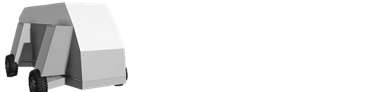
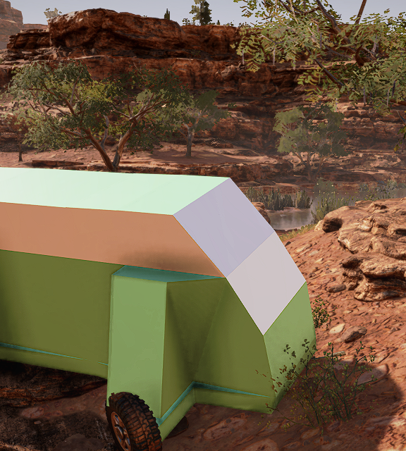
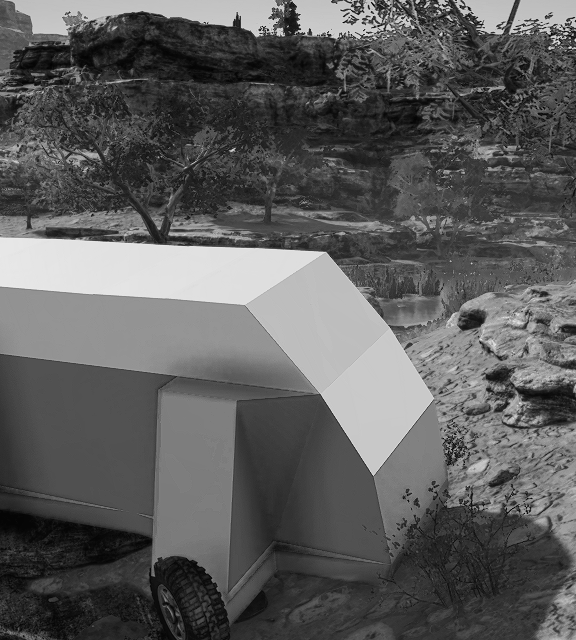

# Step 7: Creating Truck Images

## Overview
Now, we need to create images that we have referenced in the [XML file of the truck class][step_5], but have not created yet.

Particularly, we have referenced two such images in [`<TruckData>`][truckdata] tag:

```xml
	<TruckData
    	...
		TruckImage="mytruck_preview_pic"
		TruckImageSmall="mytruck_small_pic"
		...
    >
		...
	</TruckData>
```

and two images in [`<UiDesc>`][uidesc] tag:

```xml
		<UiDesc
			...
			UiIcon576x640="mytruck_store_pic"
			UiIcon576x640Bw="mytruck_store_bw_pic"
			...
		/>
```
Where:

-   `TruckImage` – The preview image of the truck. Used in the list of purchased trucks in the Headquarters and in other places in the UI where the preview image of the truck is necessary. 

-   `TruckImageSmall`– The small image of the truck. Used for the small upper slots in the UI that show trucks selected for the Expedition.

-   `UiIcon576x640` – The image that will be used in the Truck Store. 

-   `UiIcon576x640Bw` – The image that will be used in the Truck Store when this truck is locked. 

**TIP**: To make UI of your truck more polished, you can also specify images for Trade Screens. They are specified in the `TruckImageTrade` and `TruckImageTradeRight` attributes of the [`<TruckData>`][truckdata] tag.

For these images to reside peacefully in the UI of the game, there are certain [requirements](#requirements) for them that we will follow.

And, we have created a pack of [sample images](#sample-images) for you.

## Requirements

### Location
All these images should be put into the `ui\textures` subfolder of the [folder of the mod][mod_folder].

Please note that names of images in the attributes above are specified without the file name extension. 

I.e., if you are referncing `mytruck_preview_pic` in the attribute, the game will search for `mytruck_preview_pic.png` in this folder. 

### Format
All these images must be created in the `PNG` format.

### Dimensions and Transparency
Dimension and transparency requirements are the following:

-   `TruckImage` – Dimensions: `380 x 92`. Typically, has transparent backgound and the image of the truck on the left side of it.
-   `TruckImageSmall`– Dimensions: `124 x 52`. Typically, has transparent backgound. 
-   `UiIcon576x640` – Dimensions: `576 x 640`. Not transparent.
-   `UiIcon576x640Bw` – Dimensions: `576 x 640`. Typically, is a black-and-white version of `UiIcon576x640`.

## Sample Images
We will not actually *create* images here. 

Typically, they are created as the final part of the mod, after testing it, enjoying it passing all possible obstacles, selecting the best camera angle for it, and many other things.

We will do all of this later. Now – we will use very simple images to get the mod up and running.

According to names we have [specified](#overview) before and the [requirements](#requirements), these images may be similar to the following:

|**Image**                              | **Image Name**                                                 | 
|---------------------------------------|----------------------------------------------------------------|
|   | [`mytruck_preview_pic.png`](./media/mytruck_preview_pic.png)   | 
|     | [`mytruck_small_pic.png`](./media/mytruck_small_pic.png)       | 
|     | [`mytruck_store_pic.png`](./media/mytruck_store_pic.png)       | 
|  | [`mytruck_store_bw_pic.png`](./media/mytruck_store_bw_pic.png) | 

You can simply download them, put them to the `ui\textures` subfolder, and you will be ready for the [next step][step_8].  

[mod_folder]: ./step_0_prerequisites.md#mod-folder
[truckdata]: ./../../tags_and_attributes_of_trucks/truck/truckdata/index.md
[uidesc]: ./../../tags_and_attributes_of_trucks/truck/gamedata/uidesc/index.md
[step_5]: ./step_5_creating_xml_file_of_truck_class.md
[step_8]: ./step_8_testing_and_publishing.md