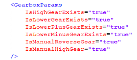
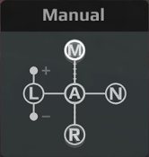
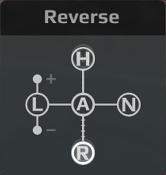

# Analog Throttle Control Mode

In Season 3, two new transmission control modes have been introduced: `IsManualHighGear` and `IsManualReverseGear`. These parameters introduce new gearbox functionality, allowing for more precise manual control of vehicle movement in **HighGear** and **ReverseGear**.

`IsManualHighGear` and `IsManualReverseGear`, like other parameters of this type of gearbox, are set in the vehicle's gearbox XML files within the `<GearboxParams>` value block. The is a boolean parameter (accepts only *true* or *false* values), and when set to **true**, the gearbox behavior **will be modified**.

!!! info

    Due to design differences between drone and vehicle transmission systems, adding `IsManualHighGear` and `IsManualReverseGear` parameters to drone gearbox XML files is technically possible, but they will have no effect on drone behavior.

The `IsManualHighGear` and `IsManualReverseGear` parameters are optional for both drone and vehicle gearbox configurations. By default, they are always set to **false** (functionality disabled).

| IsManualHighGear | IsManualReverseGear |
|-------------|-------------|
|  |  |
