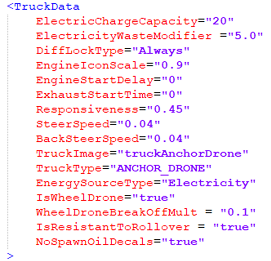
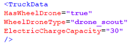
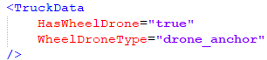

# Calling Drones from Addons

In Season 3, the drone functionality has been expanded. Two new drones have been introduced: **4-NCR** and **SCT-6**. All drones are now categorized into 3 distinct classes:

- **CR-G0** — `CARGO_DRONE`
- **4-NCR** — `ANCHOR_DRONE` 
- **SCT-6** — `SCOUT_DRONE`

To assign a wheeled drone to a specific class, specify the corresponding `TruckType` parameter value in the drone's XML file (similar to `truck.xml`) within the <TruckData> block.

!!! info

    In Season 3, it is impossible to create new drone classes, but you can replace drones within existing classes.

In both the `frame_module_drone` frame modules and `drone_scout_carrier` add-ons you can specify a link to the specific wheeled drone that will be contained there.

| frame_module_drone | drone_scout_carrier |
|-------------|-------------|
|  |  |

To link modules and add-ons with a specific drone:

1. Set the `HasWheelDrone` parameter in the `<TruckData>` block of the module or add-on.
2. Add the new `WheelDroneType` parameter with a value matching the required wheeled drone:
   - **CR-G0** — `drone_cargo`
   - **4-NCR** — `drone_anchor`
   - **SCT-6** — `drone_scout`
