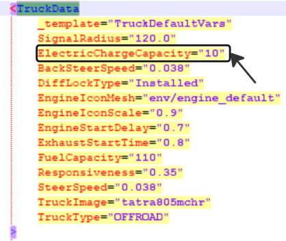
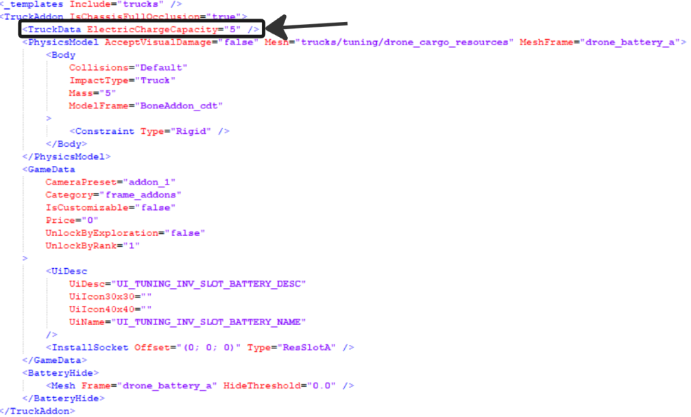

# Electricity

!!! info

    This feature is valid for Expeditions only.

**Battery charge** (`ElectricChargeCapacity`) is the new resource for vehicles and wheeled drones available in Expeditions starting from Season 2. It determines the maximum value of the electricity parameter in an entity. The electric charge parameter works similarly to another type of resource — fuel, and is consumed during the operation of vehicles, wheeled drones, and some other tools.

Battery charge can be used for:

- Vehicles
- Wheeled drones
- Tools
- Metal detector

!!! note

    In Season 3, additional tools can be added to the entities that consume electrical charge.

The battery charge consumption operates on a principle similar to fuel consumption: the entities consume a certain amount of battery charge per minute of their operation.

- **Wheeled drones** — the consumption is calculated similarly to fuel consumption.
- **Metal detector** — consumption is represented by an absolute numerical value that is spent every minute while the tool is active.

## Adding parameters

You can add battery charge to:

- The vehicle's XML file and the replacement XML file — the `TruckData` value block (the same applies to the XML files of wheeled drones).

    

- The addons' XML files (`TruckAddon`) — the `TruckData` value block.

    

- The metal detector's configuration — the `game\addon_mechanics\metal_detector_controller_exp.sso` file, the **electricityConsumption** parameter.