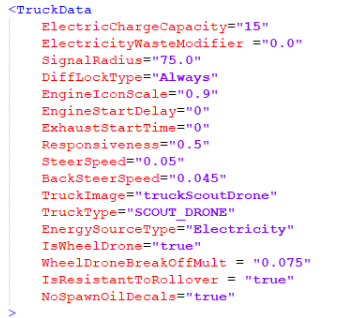
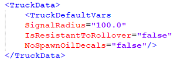

# Engine Cut-off on Rollover

In Season 3, a new parameter `IsResistantToRollover` has been introduced for all wheeled vehicles. This parameter:

- Manages the automatic engine cut-off when a vehicle or a drone rolls over.
- Determines whether the engine can be started while the vehicle or drone is upside down.

The `IsResistantToRollover` parameter is added to the XML file of a vehicle or a drone within the `<TruckData>` block. This is a **boolean** parameter (accepts only *true* or *false* values), and when it is set to **true**, the engine **will not cut off** if the vehicle rolls over.

The `IsResistantToRollover` parameter is *optional* for configuring drones or vehicles. By default it is set to **false**, which means the engine will cut off during a rollover.

You can change the default behavior of this parameter by changing its value in the `<TruckDefaultVars>` block within the `<TruckData>` section of the `trucks.xml` template file.  

