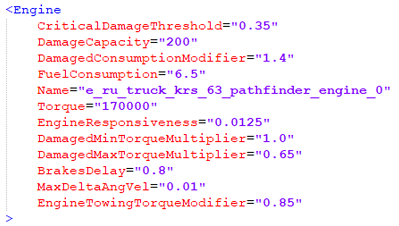
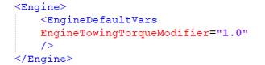

# Engine Torque Multiplier During Towing

In Season 3, a new parameter `EngineTowingTorqueModifier` has been introduced for all wheeled vehicles (the engine torque multiplier during towing). This multiplier is applied when a player, controlling any wheeled vehicle, uses a winch to tow another wheeled vehicle.

!!! info

    - The multiplier is not applied to the player's vehicle when towing a vehicle, if another player joins in cooperative mode.
    - The multiplier is not applied in cases when the player attaches to objects that are not vehicles (any objects with winch points beyond cars/drones).

`EngineTowingTorqueModifier` is a multiplier that is defined by a decimal value within the range of *0.1* to *10*. Thus, you can reduce or enhance the towing capabilities, depending on the set value.

`EngineTowingTorqueModifier` is added to the XML file of a vehicle's or drone's engine within the `<Engine>` value block. The multiplier modifies the engine's `Torque` value when a vehicle is towing another wheeled vehicle — the base `Torque` is multiplied by the `EngineTowingTorqueModifier` value specified in the engine configuration (`Torque` * `EngineTowingTorqueModifier`).

The `EngineTowingTorqueModifier` parameter is optional for drone/vehicle engine configurations; by default it is set to *1.0*.

You can modify the default behavior of this parameter by changing its value within the valid range (*0.1*-*10*) in the `<EngineDefaultVars>` block of the common `<Engine>` section in the `trucks.xml` template file.