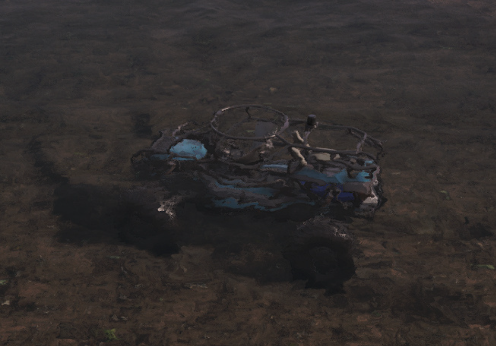

# Disabling the generation of gasoline stains in water

In Season 3, drones received the `NoSpawnOilDecals` parameter that controls gasoline stains generation in water. You can apply this parameter to any wheeled vehicle in the game.

| Stains: on | Stains: off |
|-------------|-------------|
|  |  |

The `NoSpawnOilDecals` parameter is added to the drone or vehicle's XML file within the `<TruckData>` value block. This is a **boolean** parameter (accepts only *true* or *false* values), and when it is set to **true**, the stains **are not generated**.

The `NoSpawnOilDecals` parameter is *optional* for both drones and vehicles. By default it is set to **false** (the stains are generated).

To change the default value of the parameter, modify it in the `<TruckDefaultVars>` section within the `<TruckData>` value block of the template file `trucks.xml`.
