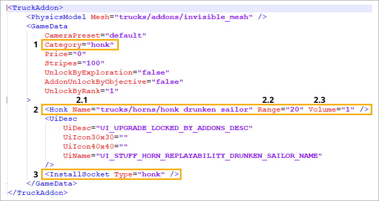

# Horns

!!! info

    This feature is valid for Expeditions only.

**Horn sounds** can be customized in Expeditions starting from Season 2. Horn addons are implemented in the same way as regular addons, but with a couple of conventions.

## Adding horn addons

To add a horn addon, create a separate socket inside the [vehicle's XML file](./../additional_info_on_trucks/viewing_trucks/opening_xml_files_of_truck.md) (`truck.xml`).

The principle of how the horn addon works is quite simple: the addon replaces the sound track specified in the `Honk` parameter's `Sound` value with the one that is defined in the addon.

The sound file format **must match the project's accepted .WAV format**. The sound file can be of any length.

!!! note

    If the vehicle has the `replacement.xml` file (the [replacement](./truck_replacements.md) XML file), make sure to add the socket there as well.

For the horn system to function properly, a universal addon named `stuff_hood_honk_default.xml` is used. This addon is installed in every vehicle by default (with the horn replacement functionality). It contains the base horn sound file for a vehicle.

Note that **the base addon itself does not contain any references to sound files**. It points to the value that is specified in the vehicle's XML file in the `Honk` parameter.

## Addon structure

The horn addon’s functionality is similar to other addons in terms of content. The key differences include:

- **1** `Category="honk"` — the value that assigns the addon to the **Horns** section within the **Decorations** menu in **Garage**.
- **2** `<Honk ...>` — the field for specifying the horn's sound path and parameters. It includes the following:
    - **2.1** `Name="..."` — the path to the sound file stored in the `\MudRunner2\Media\sounds\...` directory. **Important:** The required sound file must be stored somewhere within the `\Media\sounds` folder, but it can be located in any subdirectory inside it.
    - **2.2** `Range="..."` — the radius of the horn sound signal (in meters from center of the vehicle's coordinates). Only applicable in *cooperative mode*.
    - **2.3** `Volume="..."` — the volume at which the horn sound is played to other players. Only applicable in *cooperative mode*.
- **3** `InstallSocket` — the horn addon socket to which the addon is "attached" in the vehicle's XML file.

1. w
2. w
    1. w
    2. w
3. w