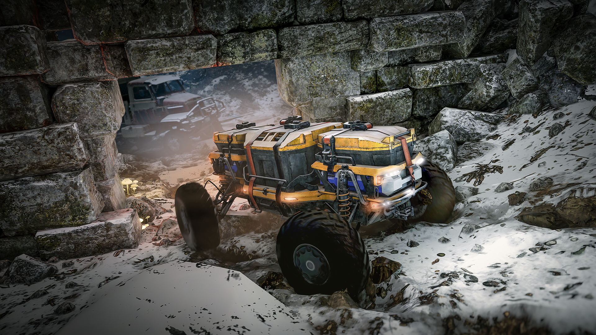
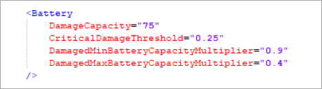
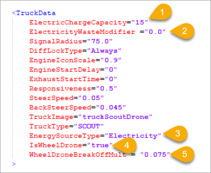
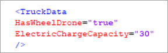
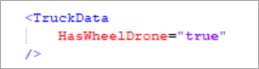

# Wheeled Drones

!!! info

    This feature is valid for Expeditions only.

**Wheeled drones** (Unmanned Ground Vehicle or UGV) are a type of transport available in Expeditions starting from Season 2.

## Adding drones

Adding and configuring drones is similar to adding vehicles to the game. As with vehicle mods, you need to add:

- **Drone's base XML file** — this file is similar to the `Truck.xml` file and it contains the drone's core parameters. You can modify these parameters, but currently it is impossible to modify drones from the game UI. Thus, the base XML file cannot be substituted with the `Replacement.xml` file.
- **XML files of main nodes** — XML files with entities of all available drone engines, gearboxes, suspension sets, wheels, and winches (`EngineVariants`, `GearboxVariants`, `SuspensionSetVariants`, `TruckWheels`, `WinchVariants`), which are defined in the corresponding drone node sockets. To make sure the drone can be used in the game, specify at least one working option in each XML file (with the exception of the file for the Winch) — otherwise, spawning will be impossible or it will cause a crash. Just like in the case of the drone's basic XML file, you can add multiple node variants to the XML file, but according to the game's functionality it will be impossible to replace them in the game. The easiest way is to replace the default nodes in the corresponding node sockets (`EngineSocket`, `GearboxSocket`, `SuspensionSocket`, `Wheels`, `WinchUpgradeSocket`).
- **XML files of additional addons** — drones support additional addons, which are installed in the same way as in vehicles — through the corresponding addon sockets (`AddonSockets`) defined in the drone's basic XML file. Addons include all the functionalities of standard vehicle addons (`TruckAddon`). However, for them there is no option for installation or replacement within the in-game functionality (garage) (similar to the previously mentioned entities (`Replacement.xml` and `EngineSocket`, `GearboxSocket`, `SuspensionSocket`, `Wheels`, `WinchUpgradeSocket`). To replace addons, you can only change the default values of the addons installed in the sockets.

## New parameters and functionality

### Damage system

Unlike regular vehicles, drones do not have unit colliders (`DamageArea`), so drones have a slightly different system of damaging the main units.

The main units:

- **Suspension** — the main unit of the drone that absorbs damage from excessive impulses hitting the drone's primary collider. Its functionality is similar to that of a vehicle's suspension. When the damage percentage exceeds the `CriticalDamageThreshold` value, the suspension begins to degrade until it reaches 0%. At this point, the suspension sags significantly, reducing the drone's ground clearance.
- **Engine** — the secondary unit of the drone that takes damage if the suspension is already broken. Its functioning is similar to a vehicle's engine. When the damage percentage exceeds the `CriticalDamageThreshold` value, the engine starts to degrade until it reaches 0%. At this point it loses power and no longer responds to the throttle button.
- **Battery** — the secondary unit of the drone that is responsible for taking damage when the drone submerges below the waterline (the *Snorkel* point). When the node damage percentage reaches above the `CriticalDamageThreshold` percentage value, then as further damage occurs (the progression of the `DamageCapacity` value, down to 0%), the drone's maximum battery charge (`ElectricChargeCapacity`) will degrade as a percentage from the `DamagedMinBatteryCapacityMultiplier` value to the `DamagedMaxBatteryCapacityMultiplier` value. In case the drone battery is damaged and the current battery charge (the `ElectricChargeCapacity` parameter) is higher than the reduced maximum charge value, then the current battery charge will be automatically decreased to the reduced maximum battery charge value.

    

    

## New parameters

Among the new parameters the following can be highlighted:

1. `ElectricChargeCapacity` — drone battery charge parameter.
2. `ElectricityWasteModifier` — parameter of increased battery consumption when leaving the signal radius (the `SignalRadius` value of the vehicle from which the drone was dropped, read more below). It is expressed as an absolute value of charge consumption per minute, which is added on top of the total battery consumption of the drone regardless of whether the drone is moving or not (but it does not apply if the drone's engine is turned off).
3. `EnergySourceType="Electricity"` — parameter that determines whether the battery charge (`ElectricChargeCapacity`) or fuel (`FuelCapacity`) will be consumed when the drone is being used.
4. `IsWheelDrone="true"` — parameter required for the game to identify the entity as a drone. **Without it** all the associated drone functionality **will not work**.
5. `WheelDroneBreakOffMult = "0.05"` — the multiplier of the required momentum (impulse) in order to pull out physical objects with a drone.

## Additional functionality

### Signal Radius

The movement of all drones in the game is limited by a new parameter — the signal radius (`SignalRadius`). It affects the drone's battery consumption when the drone leaves the signal radius. In all cases, the radius is set in meters from the center of the entity's coordinates.

The signal radius is available for:

- All vehicles in the game — set by the `SignalRadius="..."` parameter in the `TruckData` block of the vehicle's base XML file (`Truck.xml`).
- Base modules — in this case, the signal radius is available for the *Generator* base module. 
- Items — in this case, the radius is available for the *Signal Relay* item.

## Drone modules

In season 2, two types of modules for transporting drones are added:

- **frame_module_drone** — a small frame module for trucks that allows you to transport a drone. It also includes the additional battery charge value (`ElectricChargeCapacity`). In order for the frame module to include a drone, set the `HasWheelDrone="true"` value in its `TruckData` block:

    

- **drone_scout_carrier** — smaller addons (for several scouts), installed on the roof of the **Scout** class vehicles, which also allow you to transport a drone, but without the additional battery charge value. In order for the addon to include a drone, set the `HasWheelDrone="true"` value in its `TruckData` block.

    

## Important note

At the time of the Season 2 release, the functionality of drone modules described above has no way to differentiate drones. It means that the drone modules functionality is designed only for the presence of only one type of drones — CR-G0 (cargo drone). The system cannot recognize any other drones created by modders.

The only way to bypass the system is to overwrite the existing CR-G0 drone. This will allow you to use the complete functionality of the drone system.

!!! note

    In the Season 3, the functionality of modules and addons for calling drones will be expanded. It will allow you to specify in `TruckData` the ID of the specific drone that will be called.

