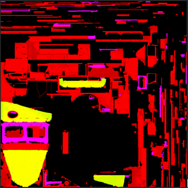
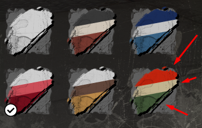
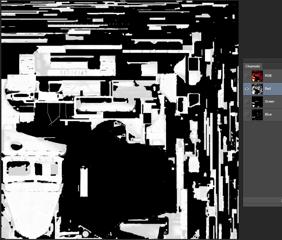
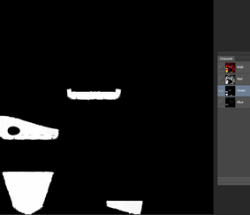
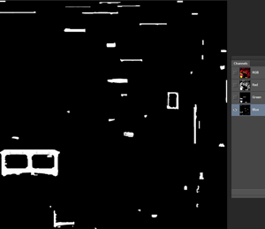
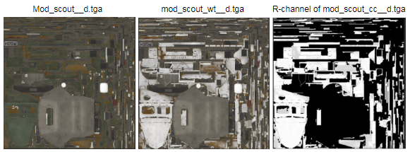

# MaterialOverride

**NOTE**: For general info on Color Customization, see [Color Customization](./../../../../additional_info_on_trucks/color_customization/color_customization.md).

The `<MaterialOverride>` describes override of the material.

Any truck material defined by the [`<Material>`](./../../material/index.md) tag can be overridden in the `<MaterialOverride>` tag.

Using the `<MaterialOverride>` tag, you can replace the material maps with other ones and change the color tint. For the created `MaterialOverride` block, you can specify the zones that will be affected by this change of color. Each particular overridden material can have up to three color tints.

With `<MaterialOverride>`, you can override all the attributes of the `<Material>` tag. The attributes that you do not override will keep their initial values. Below, we will list all the attributes of the `<MaterialOverride>` tag. However, we will omit descriptions of the attributes that are identical to the attributes of the [`<Material>`](./../../material/index.md) tag.

Attributes:

-   `Name="skin_00"`  
    The name of the [color customization](./../../../../additional_info_on_trucks/color_customization/color_customization.md). This name links the override of the material with color presets. All color presets of the truck (defined by the [`<CustomizationPreset>`](./../../../truckset/truck/customizationpreset/index.md) tags) with the value of the `MaterialOverrideName` attribute matching the specified `Name` value, will set the color tint parameters for this material.

-   `TargetMaterialName="mod_scout_mat"`  
    The name of the material that will be overridden, as it is specified in the [`<Material>`](./../../material/index.md) tag.

-   `TintMap="trucks/mod_scout_cc__d.tga"`  
    The map that defines the paint zones.  
    
    
    These zones are set via RGB channels. Thus, you can set up to three tint colors:  
    
    
    **NOTE**: The `TintMap` defines only the *zones* themselves, but not the tint values that will be used for the colorization of these zones. The tint values are defined in the `customiztion_preset.xml` (see [TruckSet](./../../../truckset/index.md)), inside the `<CustomizationPreset>` tags.
    
    The channels of this map allow you to set the following:

    -   **R** - the main color. Low values on the R mask correspond to the decrease in the colorization for ALL layers. Along with that, this color defines the overall paint zone. I.e., for all areas that are *not* painted in the red channel, the color tint will not change, regardless of the values ​​specified for these areas in the green and blue channels. Since this color defines the overall paint area, scratches and chips can be painted only in the red layer.
        
        

    -   **G** - the second layer for painting.
        
        

    -   **B** - the third layer for painting.
        
        

-   `TintMaskScale="1.01"`
    The multiplier for the value of Tint from the `TintMap` texture (see above). This multiplier allows you to make a sharper border of the mask. If the TintMap is made correctly, this multiplier is not necessary.

-   `AlbedoMap="trucks/mod_scout_wt__d.tga"`
    The map with the base color of the surface. This can be either a map with a completely new coloring for the vehicle or a map prepared for the change of the tint.
    For correct tinting, all areas where you want to apply the tint should be white. The brightness of the white color should be, on average: `RGB 220: 220: 220`.
    For example, in the pictures below, you can see the original texture (the 1st picture), the texture, which is prepared for painting (the 2nd picture), and the zones of painting (the 3rd picture).  
    

Other attributes are the same as the attributes of the `<Material>` tag and simply override its corresponding values:

-   `AlphaKill`

-   `Blending`

-   `NormalMap`

-   `NormalScale`

-   `ShadingMap`

-   `MetalnessScale`

-   `MetalnessВias`

-   `RoughnessScale`

-   `RoughnessВias`

-   `AmbientOcclusionIntensity`

-   `ReflectivityMultiplier`

-   `EmissiveMap`

-   `SnowUpIntensity`

-   `SnowUpNormalsSpace`

-   `SnowUpNoiseIntensity`

-   `SnowUpNoiseScale`

-   `SnowUpAngleRange`

-   `SnowUpFlatten`

-   `SnowifyNoiseIntensity`

-   `SnowifyNoiseIntensityShift`

-   `SnowifyNoiseTilingMult`

-   `ForceSnowUnderwater`

For a description of these attributes, see [`<Material>`](./../../material/index.md).

