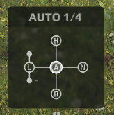
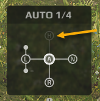
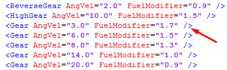
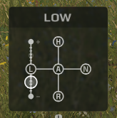

# GearboxParams

The presence of gears in the gearbox.

Attributes:

-   `IsHighGearExists="true"`  
    "H". If `false`, the button is inactive (the `<HighGear>` tag does not make sense in this case). Default value: `true`.  
     

-   `IsLowerPlusGearExists="true"`  
    "L+". First gear (the first `<Gear>` tag by order of occurrence in the XML).
      
    If `false`, the button is inactive. Default value: `true`.

-   `IsLowerGearExists="true"`  
    "L". Maximum angular velocity `0.45*AngVel` from the first gear (see the `IsLowerPlusGearExists` attribute above). If `false`, the button is inactive.
    Default value: `true`.

-   `IsLowerMinusGearExists="true"`  
    "L-". Maximum angular velocity `0.2*AngVel` from the first gear (see the `IsLowerPlusGearExists` attribute above). If `false`, the button is inactive.
    Default value: `true`.

-   `IsManualLowGear="true"`  
    The `true` value enables manual and more precise switching mode from L- to L+ using an additional scale.  
     
