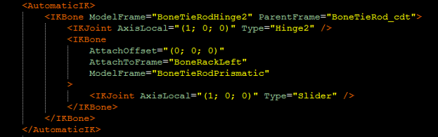

# AutomaticIK

Section that describes bones with inverse kinematics.

This section describes the bone chains of inverse kinematics (IK). This IK is controlled by the bones of the physical model or any other non-physical bones.

This picture shows a chain of two bones.

See [Non-Physical Bones](./../../../general_info/fbx_file_structure/non_physical_bones.md#automaticik) for details.
