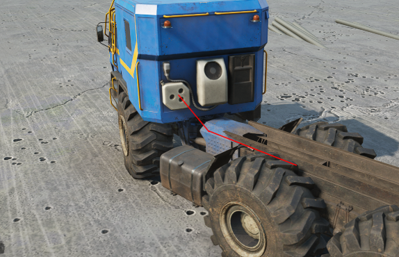

# ControlledConstraints

Section that describes controlled constraints of the Truck.

The constraint is controlled using the keyboard (by two buttons). When you press and hold the control button, the constraint starts to approach its minimum or maximum value.

For trucks – within the XML class of the **truck**, *not* an add-on and (for SnowRunner) *not* a trailer – it is used only for controlling that is **attached to steering**. That is, these constraints can only be controlled when steering and the speed of their operation is related to the speed of rotation of the wheels. I.e., by deafult, on PC keyboard, the `A` and `D` buttons control these constraints when the game is in the truck control mode.

**NOTE**: For information of Conrolled Constraints of Addons, see [FastMode. Controlled Constraints of Addon](./../../../additional_info_on_trucks/addons_selected_info/fast_mode.md) and its subsections.

