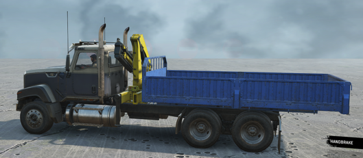

# AddonsShift

Shift of the installation point of the addon (trailer), if another addon is already installed.

Attributes:

-   `Types="Minicrane"`  
    *(Mandatory.)* The name of the addon type, upon installation of which the described addon will be shifted.

-   `Offset="(0; -0.095; -0.05)"`  
    *(Mandatory.)* An offset of the addon bone when it is installed on a truck.

-   `TrailerNamesBlock="LargeSemitrailerOiltank"`  
    Ban on the trailer installation when a pair of addons with a shift is installed. For example, it is necessary, when the installation of the crane shifts the body so that it interferes with the installation of the trailer.

    

