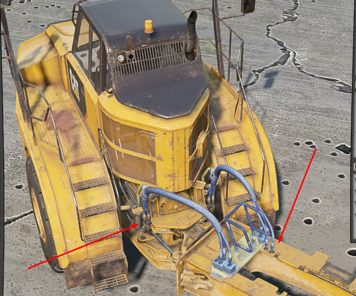
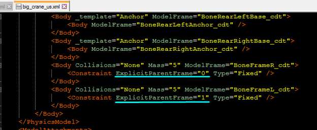
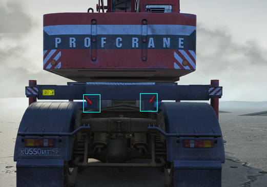

# ExtraParent

Explicit attachment of the addon bone to the bone of the truck.

The `<ExtraParent>` tag is used only in the description of the truck (not within addon descriptions) if it is insufficient to attach the addon to a single bone of the truck. For example, in the picture below, the wires are an addon and are attached both to the rear part of the vehicle and to its front part.

*Interaction of the ExtraParent with an addon:*

In the addon file, the bone constraint that should be attached to the truck is specified with the `ExplicitParentFrame` attribute of the `<Constraint>` tag. This attribute sets the number corresponding to the order of the `<ExtraParent>` tags occurrence in the description of the addon socket in the truck file. For example, as shown in the pictures below:

In the pictures above, it is described that the addon is attached to the truck chassis using the three bones, two of which are shifted by some `Offsets`. This is done to raise the crane above the mudguards and install it on the narrow frame of the truck.

Attributes:

-   `Frame="BoneCabin_cdt"`  
    *(Mandatory.)* A name of the bone from the physical model of the truck, which the addon bone is attached to.

-   `Offset="(-1; 0; 0)"`  
    An offset of the addon bone when it is installed on a truck.

