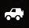
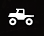
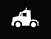
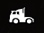
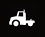

# UiDesc

UI block for the truck.

Attributes:

-   `UiDesc="UI_VEHICLE_MOD_SCOUT_DESC"`  
    Description of the truck. A small description of what kind of a vehicle it is, in general.

-   `UiIcon30x30="scoutVehicleImg30"`  
    Icon of the *type* of the truck (small version). The icon has a white color. The set of these icons is fixed. I.e., you can set one of the following icons for your truck here:

    -   `scoutVehicleImg30` - icon for scouts:  
        

    -   `offroadVehicleImg30` - icon for offroad vehicles:  
        

    -   `highwayVehicleImg30` - icon for highway vehicles:  
        

    -   `heavyVehicleImg30` - icon for heavy vehicles:  
        

    -   `heavyDutyVehicleImg30` - icon for heavy duty vehicles:  
        

-   `UiIcon40x40="scoutVehicleImg"`  
    Icon of the *type* of the truck (the large version with outline). The icon has a white color and a black outline. The set of these icons is fixed. I.e., you can set one of the following icons for your truck here:

    -   `scoutVehicleImg` - icon for scouts

    -   `offroadVehicleImg` - icon for offroad vehicles

    -   `highwayVehicleImg` - icon for highway vehicles

    -   `heavyVehicleImg` - icon for heavy vehicles

    -   `heavyDutyVehicleImg` - icon for heavy duty vehicles

-   `UiIcon328x458="shopImgModScout"`  
    *For Expeditions:*  
    The attribute exists, but it is not used.  
    *For SnowRunner:*  
    The image that will be used in the Truck Store, for cards of vehicles.  
    Location: In the folder of the mod, in the `/ui/textures/` subfolder.  
    Dimensions: `328 x 458`.  
    Format: `PNG`.  

-   `UiIcon576x640="mytruck_store_pic"`  (NEW)  
    *(Valid for Expeditions only)*  
    The image that will be used in the Truck Store, for cards of vehicles. It is shown when the truck is available for purchasing.  
    Location: In the folder of the mod, in the `/ui/textures/` subfolder.  
    Dimensions: `576 x 640`.  
    Format: `PNG`.

    **NOTE**: The [`<TruckData>`](./../../truckdata/index.md) tag also has attributes that allow you to configure images of the truck.   

-   `uiIcon576x640Bw="mytruck_store_pic_bw"`  (NEW)  
    *(Valid for Expeditions only)*  
    The black-and-white image of the truck that will be used for it in the Truck Store *when this truck is locked*.  
    Location: In the folder of the mod, in the `/ui/textures/` subfolder.  
    Dimensions: `576 x 640`.  
    Format: `PNG`.

-   `UiIconLogo="modScoutLogo80"`  
    *For Expeditions:*  
    The attribute exists, but it is not used.  
    *For SnowRunner:*  
    Manufacturer logo. It is used only in the Truck Store, for cards of vehicles. This icon must be in a white color and have the transparent background.  
    Dimensions: `80 x 80`.  
    Format: `PNG`.

-   `UiName="UI_VEHICLE_MOD_SCOUT_NAME"`  
    Name of the truck.

